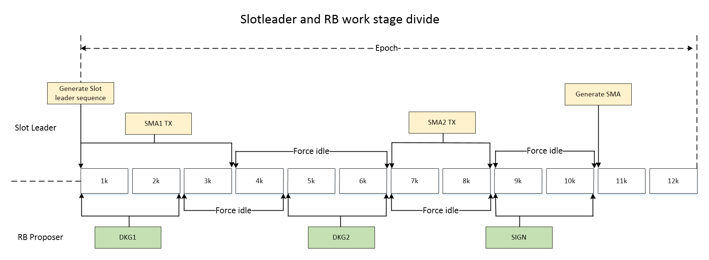
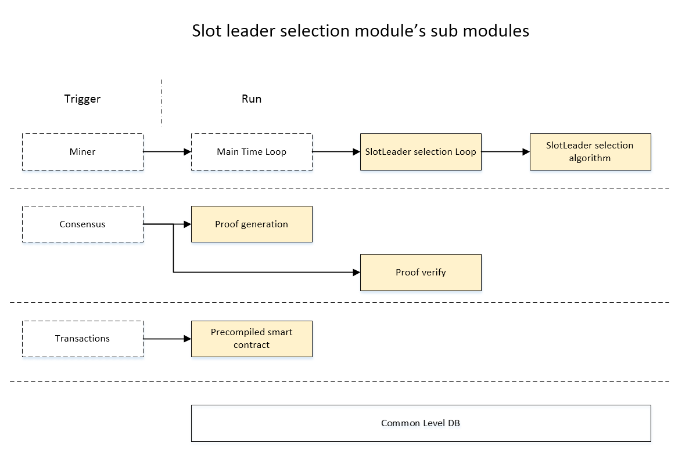
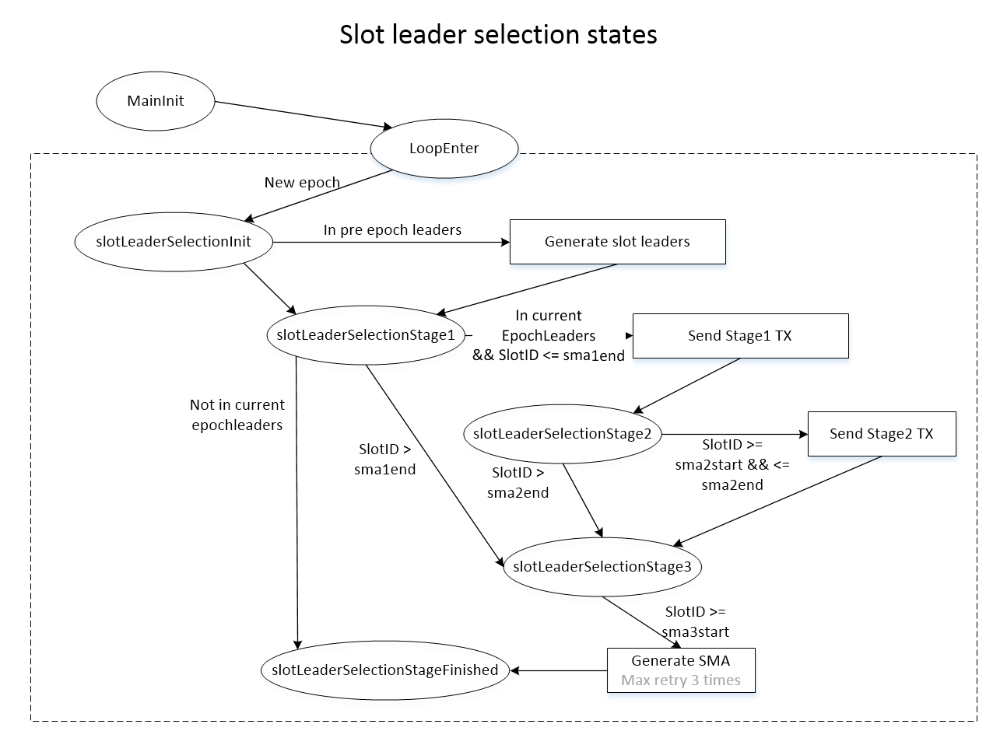
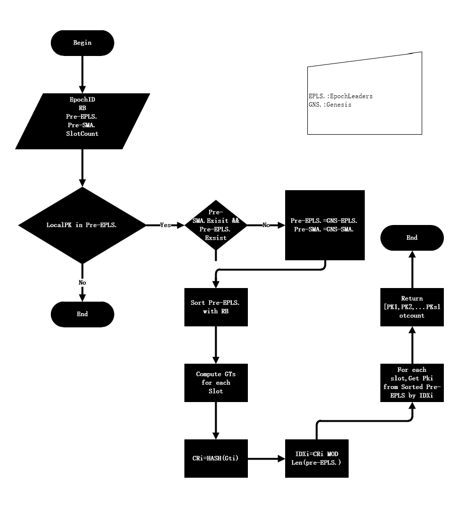
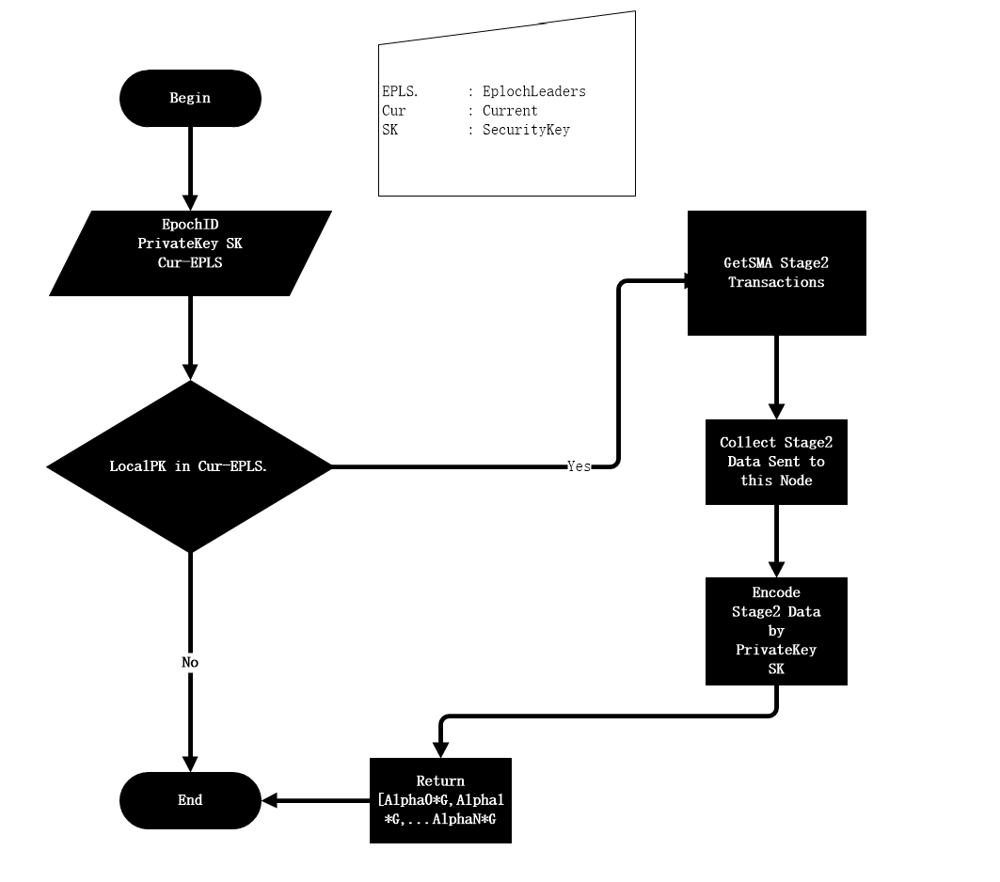
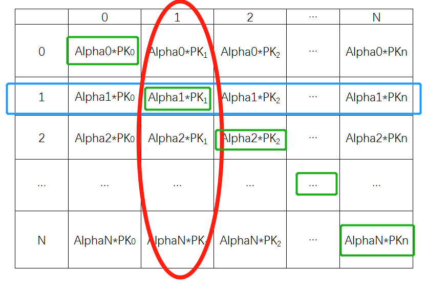
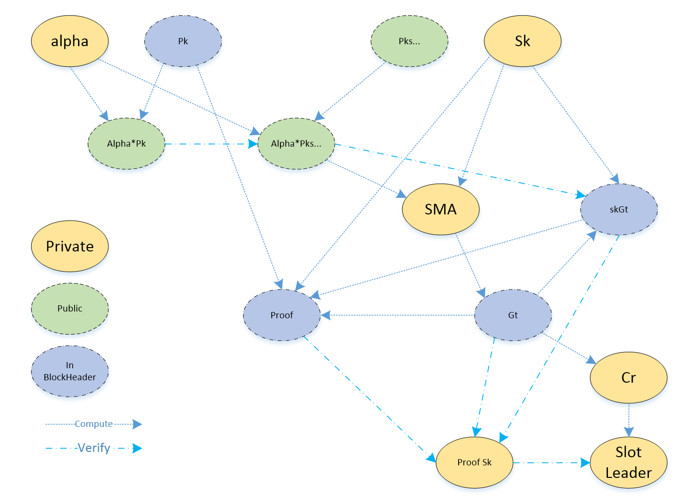
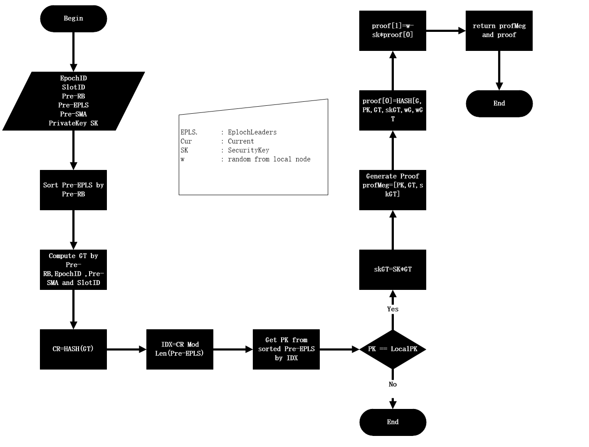
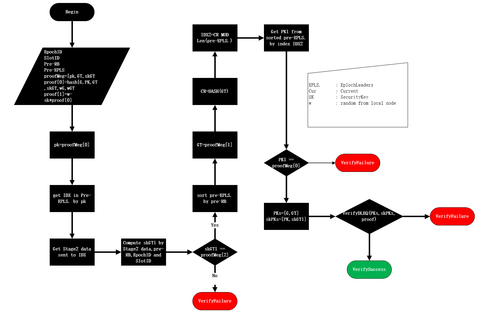

Slot leader selection 
======================

Introduction
------------

Slot leader selection use to select unique miner of slots from epoch leaders.
Slot leader selection mainly select a sequence, and use this sequence to match
previous epoch leaders to get the unique slot leader.

The slot leader should be issue block anonymously and the block should be
verified publicly.

Time divide
-----------

Slot leader selection’s execution period based on 1 epoch, and the behavior is
the same in each epoch.

Divide the slots in each epoch into 10 groups, each include K slots.

The selection cycle is designed to be send Stage 1 transactions in 1K, and
forced idle in 2K, 3K\~4K to send Stage2 transactions, 5K forced idle, and in 6K
to calculate SMA. This SMA value is stored in the local LevelDB and is used by
the next epoch to calculate the slot leader. Since the RB calculates the random
number at 7k, the slot leader selection need to generate the SMA to end before
7k to ensure that the result cannot be changed.

If the transaction arrives at the precompiled contract within the forced idle
time range, the information is not allowed to write to StateDB. For example,
only the Stage2 transaction received during the 3k\~4k process allows data to be
written to the StateDB, and the Stage2 transactions received at other times are
not written to the StateDB.

As shown below:

The main steps include:

1. Generate slot leader sequence by RB and PKs. Use the Epoch Leader generated
by the previous Epoch as the basis to match the slot leader sequence, and
calculate the current block of each slot of the epoch;

2. The epoch Leader selection module (external) generates the epoch Leader of
the current epoch for transaction sending and next epoch mine;

3. Node in current epoch leader sends a transaction;

4. Node in current epoch leader calculate the SMA for the next Epoch slot
selection before starting the generation of the RB random number;

Code structure
--------------

The slot leader function code is mainly composed of the following parts: work
loop, selection algorithm, pre-compiled contract, Proof generation, proof
verification, and LevelDB encapsulation shared by POS.

Code is in these paths below:

| pos/slotleader/\*.go core/vm/slot_leader_selection_contract.go pos/posdb/\*.go pos/postools/slottools/\*.go |
|-------------------------------------------------------------------------------------------------------------|

Work loop
---------

The work loop is periodically triggered by the Main Time loop. During the
running process, the current epoch ID and slot ID are obtained. For each epoch
ID, four execution phases are divided according to the slot ID. They are:

Stage 1: slot leader selection initial;

Stage 2: generate slot leader; Send Stage1 TX;

Stage 3: Send Stage2 TX;

Stage 4: Compute and Generate SMA;

Stage 5: Complete, wait for the next epoch.

The corresponding code is in the following location:

| pos/slotleader/workflow.go |
|----------------------------|

Selection algorithm
-------------------

In this system, slot leader selection module is responsible for slot leader
selection. The candidate should be in the pre-epoch epoch leaders; no one can
know the selected leaders of each slot except the candidate in the epoch leader
group. Below is the algorithm of the slot leader selection flow.

Note:

Sort pre-EPLS. is in order to increasing the randomness of the selection.

Generate SMA
------------

SMA is Security Message Array which is shared in the pre-epoch epoch leader
group. The SMA is used to produce the slot proof and to generate slot leader
group. Since it is security, the verifier cannot know SMA, so the verifier using
the data on the block chain to verify the slot. From this data on the block
chain, users can not deduce the security message for security. Below is the
procedure of generate SMA.

In order to clarify the relationship of stag1 transaction of SMA, stage2
transaction of SMA and SMA data.

Note:

From above chart, we suppose local node’s index in epoch leader group is 1.

**stage1 transaction**: row1 and colum1, local node send transaction with data
Alpha1\*PK1, here Aplha1 is the commit of local node.

**Stage2 transaction**: the whole raw 1, stage2 transaction should make sure the
rand Alpha1 should be same with the one in stage 1.

**SMA:** The whole colum1, the local node, here the index in epoch leader group
still is 1. local node collect all the data sent to it, and use local node’s
private key to decode the stage two data, and get a array such as [Aplha0\*G,
Aplha1\*G, Aplha2\*G, …, AplhaN\*G].

From other nodes, they also use theirs’ private key to decode the data of stage
2 which sent to them. They also can get the same SMA array above.

Proof generate
--------------

For the selected slot leader which is responsible for the bock proposer, it uses
the security message to produce the proof. Below is the produce for slot proof
generation.

Note:

In generate proof and proof verify, if there is no valid SMA, pre-epoch leaders
group, system use the genesis SMA, genesis epoch leaders, and genesis SMA stage
one and stage two data to generate slot proof and verify.

In order to focus on the main procedure and clarify the proof and verification
main skeleton, above chart does not include the scenario of genesis data.

Proof verify
------------

For normal users, they do not know the security message array(SMA), what they
know is the data on the block chain. Such as pre epoch random, and SMA stage2
transaction data and so on.

Note:

**Verify skGT**: It is used to verify the skGT included in the proof right or
not, of course the block proposer can counterfeit skGT. But if they provide skGT
in proof, he or she should make the data consistent with the data on block.

**Verify PK:** Verifier use the GT in the proof, and he or she compute the slot
leader, and check the slot leader is equal the block proposer or not.

**Verify DLEQ:** It prevent the block proposer forging GT and skGT, verify will
produce the proof by computing and check the computed proof equal the proof
provided by the claimer or not.
