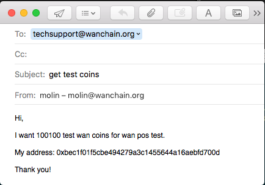

# 1. WanPoS Getting started manual

# 2. Introduction

WanPoS Getting started manual can help users to download a pos node and perform as a pos miner or pos synchronizer.

You can follow the getting started manual to experience the POC version of WanPOS.

# 3. Contents

<!-- TOC -->

- [1. WanPoS Getting started manual](#1-wanpos-getting-started-manual)
- [2. Introduction](#2-introduction)
- [3. Contents](#3-contents)
- [4. Quick start from docker](#4-quick-start-from-docker)
    - [4.1. Step by step to be a miner](#41-step-by-step-to-be-a-miner)
    - [4.2. Step by step to delegate wan coins](#42-step-by-step-to-delegate-wan-coins)
- [5. Download and Run](#5-download-and-run)
    - [5.1. Run from Docker](#51-run-from-docker)
    - [5.2. Download](#52-download)
        - [5.2.1. Download BIN](#521-download-bin)
        - [5.2.2. Download Code and Compile](#522-download-code-and-compile)
    - [5.3. Run](#53-run)
        - [5.3.1. Run as a synchronize node](#531-run-as-a-synchronize-node)
        - [5.3.2. Run as a miner node](#532-run-as-a-miner-node)
- [6. Operations](#6-operations)
    - [6.1. PoS account creation](#61-pos-account-creation)
    - [6.2. Check balance](#62-check-balance)
    - [6.3. Get test wan coins of PoS](#63-get-test-wan-coins-of-pos)
    - [6.4. Stake register and Delegate](#64-stake-register-and-delegate)
    - [6.5. Check Incentive](#65-check-incentive)
    - [6.6. Stake unregister and Unlock](#66-stake-unregister-and-unlock)
- [7. Test result of incentive](#7-test-result-of-incentive)

<!-- /TOC -->

# 4. Quick start from docker

## 4.1. Step by step to be a miner

Step 1 install docker (Ubuntu):
```
$ sudo wget -qO- https://get.docker.com/ | sh

$ sudo usermod -aG docker YourUserName

$ exit
```

Step 2 start gwan with docker and create account:
```
$ docker pull wanchain/wanpos

$ docker run -d -v /home/YourUserName/.wanchain:/root/.wanchain wanchain/wanpos /bin/gwan --pluto

YourContainerID

$ docker exec -it YourContainerID /bin/bash

root> gwan attach .wanchain/pluto/gwan.ipc

> personal.newAccount('YourPassword')

"YourAccountAddress"

> personal.showPublicKey("YourAccountAddress", 'YourPassword')

["YourPK1", "YourPK2"]

> exit

root> echo "YourPassword" > /root/.wanchain/pw.txt

root> exit

```


Step 3 get some test wan coins for "YourAccountAddress", such as 100100.

You can follow the descript in [6.3. Get test wan coins of PoS](#63-get-test-wan-coins-of-pos) to get test coins.

And after you received the test coins, you can do step 4.



Step 4 create a script file in path: `/home/YourUserName/.wanchain/minerRegister.js`

```
//minerRegister.js

// If you want to register to be a miner you can modify and use this script to run.


//-------INPUT PARAMS YOU SHOULD MODIFY TO YOURS--------------------

// tranValue is the value you want to stake in minValue is 100000 
var tranValue = "100000"

// secpub is the miner node's secpub value
var secpub    = "YourPK1"

// g1pub is the miner node's g1pub value
var g1pub     = "YourPK2"

// feeRate is the delegate dividend ratio if set to 100, means it's a single miner do not accept delegate in.
var feeRate   = 100

// lockTime is the time for miner works which measures in epoch count. And must larger than 5.
var lockTime  = 30

// baseAddr is the fund source account.
var baseAddr  = "YourAccountAddress"

// passwd is the fund source account password.
var passwd    = "YourPassword"

//-------INPUT PARAMS YOU SHOULD MODIFY TO YOURS--------------------


//------------------RUN CODE DO NOT MODIFY------------------
personal.unlockAccount(baseAddr, passwd)
var cscDefinition = [{"constant":false,"inputs":[{"name":"addr","type":"address"},{"name":"lockEpochs","type":"uint256"}],"name":"stakeUpdate","outputs":[],"payable":false,"stateMutability":"nonpayable","type":"function"},{"constant":false,"inputs":[{"name":"addr","type":"address"}],"name":"stakeAppend","outputs":[],"payable":true,"stateMutability":"payable","type":"function"},{"constant":false,"inputs":[{"name":"secPk","type":"bytes"},{"name":"bn256Pk","type":"bytes"},{"name":"lockEpochs","type":"uint256"},{"name":"feeRate","type":"uint256"}],"name":"stakeIn","outputs":[],"payable":true,"stateMutability":"payable","type":"function"},{"constant":false,"inputs":[{"name":"delegateAddress","type":"address"}],"name":"delegateIn","outputs":[],"payable":true,"stateMutability":"payable","type":"function"},{"constant":false,"inputs":[{"name":"delegateAddress","type":"address"}],"name":"delegateOut","outputs":[],"payable":false,"stateMutability":"nonpayable","type":"function"}];


var contractDef = eth.contract(cscDefinition);
var cscContractAddr = "0x00000000000000000000000000000000000000d2";
var coinContract = contractDef.at(cscContractAddr);

var payload = coinContract.stakeIn.getData(secpub, g1pub, lockTime, feeRate)
var tx = eth.sendTransaction({from:baseAddr, to:cscContractAddr, value:web3.toWin(tranValue), data:payload, gas: 200000, gasprice:'0x' + (200000000000).toString(16)});
console.log("tx=" + tx)
//------------------RUN CODE DO NOT MODIFY------------------

```


Step 5 run the register script in gwan

Follow the step 2's command line: 

```
$ docker exec -it YourContainerID /bin/gwan attach .wanchain/pluto/gwan.ipc

> loadScript("/root/.wanchain/minerRegister.js")

> exit

$ docker stop YourContainerID

$ docker run -d -p 17717:17717 -p 17717:17717/udp -v /home/YourUserName/.wanchain:/root/.wanchain wanchain/wanpos /bin/gwan --pluto --etherbase "YourAccountAddress" --unlock "YourAccountAddress" --password /root/.wanchain/pw.txt --mine --minerthreads=1 

```

Finish!

And your mining work will begin after sync block to the last one.


## 4.2. Step by step to delegate wan coins

Step 1 install docker (Ubuntu):
```
$ sudo wget -qO- https://get.docker.com/ | sh

$ sudo usermod -aG docker YourUserName

$ exit
```

Step 2 start gwan with docker and create account and select delegate:
```
$ docker run -d -v /home/YourUserName/.wanchain:/root/.wanchain wanchain/wanpos /bin/gwan --pluto

YourContainerID

$ docker exec -it YourContainerID /bin/bash

root> gwan attach .wanchain/pluto/gwan.ipc

> personal.newAccount('YourPassword')

"YourAccountAddress"

> pos.getStakerInfo(eth.blockNumber)
[
	{...},
	{...},
	{	Address: "DelegateAddress",
    Amount: 2e+23,
    Clients: [],
    FeeRate: 10,
    From: "...",
    LockEpochs: 30,
    PubBn256: "...",
    PubSec256: "...",
    StakingEpoch: 117
	}
]
```

You get `YourAccountAddress` and a good delegate `DelegateAddress` from above step which is selected by a nice `FeeRate`.

Step 3 get some test wan coins for "YourAccountAddress", such as 100100.

You can follow the descript in [6.3. Get test wan coins of PoS](#63-get-test-wan-coins-of-pos) to get test coins.

Step 4 create a script file in path: `/home/YourUserName/.wanchain/sendDelegate.js`

```
//sendDelegate.js

// If you want to send to a delegate you can modify and use this script to run.


//-------INPUT PARAMS YOU SHOULD MODIFY TO YOURS--------------------

// tranValue is the value you want to stake in minValue is 100
var tranValue = "100000"

// delegateAddr is the validator address
var delegateAddr = "DelegateAddress"

// baseAddr is the fund source account.
var baseAddr  = "YourAccountAddress"

// passwd is the fund source account password.
var passwd    = "YourPassword"

//-------INPUT PARAMS YOU SHOULD MODIFY TO YOURS--------------------


//------------------RUN CODE DO NOT MODIFY------------------
personal.unlockAccount(baseAddr, passwd)
var cscDefinition = [{"constant":false,"inputs":[{"name":"addr","type":"address"},{"name":"lockEpochs","type":"uint256"}],"name":"stakeUpdate","outputs":[],"payable":false,"stateMutability":"nonpayable","type":"function"},{"constant":false,"inputs":[{"name":"addr","type":"address"}],"name":"stakeAppend","outputs":[],"payable":true,"stateMutability":"payable","type":"function"},{"constant":false,"inputs":[{"name":"secPk","type":"bytes"},{"name":"bn256Pk","type":"bytes"},{"name":"lockEpochs","type":"uint256"},{"name":"feeRate","type":"uint256"}],"name":"stakeIn","outputs":[],"payable":true,"stateMutability":"payable","type":"function"},{"constant":false,"inputs":[{"name":"delegateAddress","type":"address"}],"name":"delegateIn","outputs":[],"payable":true,"stateMutability":"payable","type":"function"},{"constant":false,"inputs":[{"name":"delegateAddress","type":"address"}],"name":"delegateOut","outputs":[],"payable":false,"stateMutability":"nonpayable","type":"function"}];


var contractDef = eth.contract(cscDefinition);
var cscContractAddr = "0x00000000000000000000000000000000000000d2";
var coinContract = contractDef.at(cscContractAddr);

var payloadDelegate = coinContract.delegateIn.getData(delegateAddr)
var tx2 = eth.sendTransaction({from:baseAddr, to:cscContractAddr, value:web3.toWin(tranValue), data:payloadDelegate, gas: 200000, gasprice:'0x' + (200000000000).toString(16)});
console.log("tx2=" + tx2)
//------------------RUN CODE DO NOT MODIFY------------------
```

Step 5 run the register script in gwan

Follow the step 2's command line: 
```
> loadScript("/root/.wanchain/sendDelegate.js")

```

Finish!


# 5. Download and Run

## 5.1. Run from Docker

You can run a node from a docker image.

```
// Install the docker service

$ sudo wget -qO- https://get.docker.com/ | sh

$ sudo usermod -aG docker YourUserName
```

You can run a node as a sync node as below:

```
//On MacOS:
$ docker run -d -v /Users/YourUserName/Library/Wanchain/:/root/.wanchain wanchain/wanpos /bin/gwan --pluto

//On Ubuntu
$ docker run -d -v /home/YourUserName/.wanchain:/root/.wanchain wanchain/wanpos /bin/gwan --pluto
```

If you want to be a miner, you should create a account and start like this:
```
$ docker run -d -v /home/YourUserName/.wanchain:/root/.wanchain wanchain/wanpos /bin/gwan --pluto --etherbase "YourAccountAddress" --unlock "YourAccountAddress" --password YourPasswordTxtFile --mine --minerthreads=1 
```

The `YourPasswordTxtFile` is a txt file with your miner account password in it in docker.

Such as the file put in the path `/home/YourUserName/.wanchain/pw.txt` , you should start docker like this:

```
$ docker run -d -v /home/YourUserName/.wanchain:/root/.wanchain wanchain/wanpos /bin/gwan --pluto --etherbase "YourAccountAddress" --unlock "YourAccountAddress" --password /root/.wanchain/pw.txt --mine --minerthreads=1 
```


## 5.2. Download

You can download a binary file or code to perform a node.

### 5.2.1. Download BIN

You can download the compiled binary file to run. The download link is in below:

(Not ready now, please use docker)

| OS            | URL            | MD5             | SHA256
| --------------  | :------------  | :-------------: | :--: |
|Ubuntu|gwan.tar.gz| XXXXXXXXXXXXXXXX |XXXXXXXXXXXXXXXXXXXXXXXXX
|Windows|gwan.tar.gz| XXXXXXXXXXXXXXXX |XXXXXXXXXXXXXXXXXXXXXXXXX
|MacOS|gwan.tar.gz| XXXXXXXXXXXXXXXX |XXXXXXXXXXXXXXXXXXXXXXXXX


### 5.2.2. Download Code and Compile

If you want to compile WanPoS code, you should first to install golang develop environment and config $GOPATH and $GOROOT:

https://golang.org/


You can download code file and compile to run as following steps.

If you already have a golang compile and run environment, and you have configured $GOPATH , you can get the code as below:

```
$ go get github.com/wanchain/go-wanchain

$ cd $GOPATH/src/github.com/wanchain/go-wanchain

$ git checkout posalpha

$ git pull

$ make
```

Or you can clone from github.com as below:

```
$ mkdir -p $GOPATH/src/github.com/wanchain/

$ cd $GOPATH/src/github.com/wanchain/

$ git clone https://github.com/wanchain/go-wanchain.git

$ cd go-wanchain

$ git checkout posalpha

$ git pull

$ make
```

Then you can find the binary file in the path of `build/bin/gwan`

## 5.3. Run

You can start a node run in two different roles as follow.

### 5.3.1. Run as a synchronize node

```
$ gwan --pluto --rpc --syncmode "full"
```

### 5.3.2. Run as a miner node

In the following command. You should replace the `0x8d8e7c0813a51d3bd1d08246af2a8a7a57d8922e` to you own pos account address and replace `/tmp/pw.txt` file to your own password file with your password string in it.

```
$ gwan --pluto --rpc --etherbase "0x8d8e7c0813a51d3bd1d08246af2a8a7a57d8922e" --unlock "0x8d8e7c0813a51d3bd1d08246af2a8a7a57d8922e" --password /tmp/pw.txt --rpc  --mine --minerthreads=1 --syncmode "full"
```

# 6. Operations

## 6.1. PoS account creation

Before you run a PoS node you should create an account for work.

```
$ gwan --pluto console --exec "personal.newAccount('Your Password')"

// Or run after ipc attach
$ personal.newAccount('Your Password')
```

You can see your address created and printed in the screen, then you can press `Ctrl+C` to exit.

You will get a keystore file with three crypto key words in your path `~/.wanchain/pluto/keystore/` in Ubuntu or `~/Library/Wanchain/pluto/keystore/` in Mac OS.

And you can use a command to get your `Address Public Key` and `G1 Public Key` of your account.

```
$ gwan --pluto console --exec "personal.showPublicKey('Your Address', 'Your Password')"

// Or run after ipc attach
$ personal.showPublicKey('Your Address', 'Your Password')
```

These public keys will be used in the stake register.

## 6.2. Check balance

You can check your balance in address when you attach a gwan console in `ipc` file or use a console mode at gwan start.

```
// In ubuntu
$ gwan attach ~/.wanchain/pluto/gwan.ipc

// In MacOS
$ gwan attach ~/Library/Wanchain/pluto/gwan.ipc

```

After the node synchronizes finished. You can check balance use follow command.

```
$ eth.getBalance("Your Address Fill Here")

// Such as address example shown above.
$ eth.getBalance("0x8c35B69AC00EC3dA29a84C40842dfdD594Bf5d27")
```

## 6.3. Get test wan coins of PoS

If you want to get some test wan coins to experient WanPoS, you can send an email with your wan pos account test address to emails shown below to tell us. And we will pay to you in three work days. 

| Index            | Email         | 
| --------------  | :------------  | 
|1| techsupport@wanchain.org| 


## 6.4. Stake register and Delegate

If you have an account with WAN coins and you want to create a WanPoS miner, you should do it like the diagram below:


You can register as a mining node through Stake register.

We have given a smart contract for register and unregister.

Its contract interface is shown as below.
```
var cscDefinition = [{"constant":false,"inputs":[{"name":"addr","type":"address"},{"name":"lockEpochs","type":"uint256"}],"name":"stakeUpdate","outputs":[],"payable":false,"stateMutability":"nonpayable","type":"function"},{"constant":false,"inputs":[{"name":"addr","type":"address"}],"name":"stakeAppend","outputs":[],"payable":true,"stateMutability":"payable","type":"function"},{"constant":false,"inputs":[{"name":"secPk","type":"bytes"},{"name":"bn256Pk","type":"bytes"},{"name":"lockEpochs","type":"uint256"},{"name":"feeRate","type":"uint256"}],"name":"stakeIn","outputs":[],"payable":true,"stateMutability":"payable","type":"function"},{"constant":false,"inputs":[{"name":"delegateAddress","type":"address"}],"name":"delegateIn","outputs":[],"payable":true,"stateMutability":"payable","type":"function"},{"constant":false,"inputs":[{"name":"delegateAddress","type":"address"}],"name":"delegateOut","outputs":[],"payable":false,"stateMutability":"nonpayable","type":"function"}]
```

In the smart contract input parameters, the `feeRate` means the delegate dividend ratio, which is used for the delegator node. If set it to 100 means do not accept others delegate in and it's a independent mining node.

If you want to be an delegator and accept bets from others, you need to set a reasonable percentage of dividends `feeRate` to attract others to invest.

`feeRate`'s value range is from 0 to 100. Means percent to pay to delegator.

You can stake in use your custom script or just modify the module script in `loadScript/minerRegister.js`.

The JavaScript file `loadScript/register.js` shows how to stake in and delegate stake in.

In the script file, the password should be replaced to your own in `personal.unlockAccount`.

And `secpub`, `secAddr`, `g1pub` should be filled with your account address public key, account address, and G1 public key. These public keys could get in function `personal.showPublicKey` shown above.

The `lockTime` should be filled with the time you want to stake in and locked. The unit of time is epoch. A epoch time is equal to SlotTime * SlotCount. 

The `tranValue` should be filled with the amount in wan coins you want to lock in a smart contract for stake register. You can't get it back until the lock time is up.

This script can be run in an attached IPC session.

```
// This path is a relative path for your run.
$ loadScript('loadScript/register.js')
```

If you don't want to be a miner, you can bet on the delegator node, who will mine for you and share the block incentive.

The incentive percent is related to the stake amount and `feeRate`.

The delegate bet method is also in `register.js`, it is in the last 3 lines.

You can input the delegator's address to bet.

The lock time for delegate in does not work in PoC stage, it will follow the delegator's lock time.

## 6.5. Check Incentive

You can check your balance as shown above to verify whether you have got an incentive.

And you can use the commands shown below to see which address was awarded and its incentive amount for specified input epoch ID.

```
// In an attached IPC session to run for epoch 123.
$ pos.getEpochIncentivePayDetail(123)
```

## 6.6. Stake unregister and Unlock

Your locked wan coins will automate send back when time up. 

Do not need any manual operation.

# 7. Test result of incentive

We depolyed some pos miner nodes to mine.

Use different stake value and different locktime to test.

The locktime is measured by epoch count.

The epoch time is 20 minutes of one epoch. So 6 epoch means 120 minutes.

And the total stake is about 6000000 ~ 8000000 wan coins on the test blockchain.

The incentive reward to the address is shown below:

| Address     | stake | locktime | ep 1| ep 2 | ep 3 | ep 4 | ep 5 | total incentive |
| ----------  | ---- | :---: | --- | --- | ----| ---- | ---- | ---- | 
|0xbec1f01f5cbe494279a3c1455644a16aebfd700d| 100000 | 6 |0 |0.32 |1.07 |1.02 |1.94 | 4.35|
|0xa38c0aafc0b4ee45e006814e5769f17fda60f994| 200000 | 6 |0.32 |1.39 |4.40 |3.06 |2.33 |11.5 |
|0x711a9967d0b61ab92a86e14102de1233d3de5ead| 500000 | 6 |2.49 |6.03 |9.62 |10.32 |5.14 |33.6 | 
|0x52eee1ccb29adc742449a3e87fe7acaad605bd4c| 200000 | 12 |1.93 |4.81 |1.08 |1.17 |0.32 |9.31 |


If the epoch incentive is 0, means it has not been selected by its probility.


