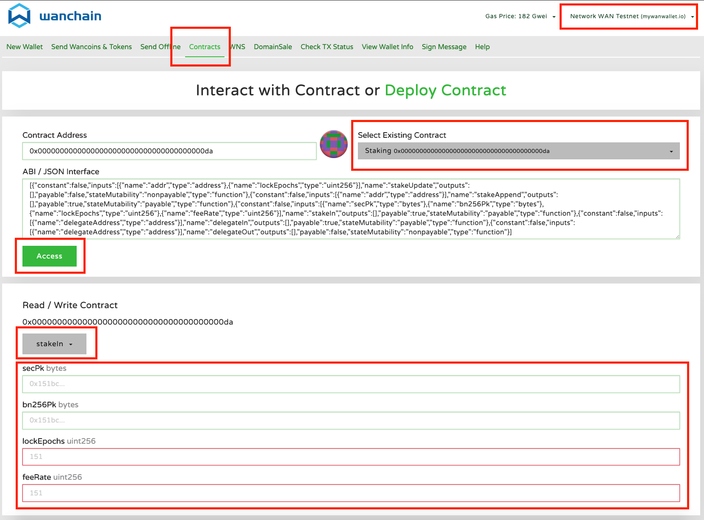
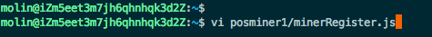
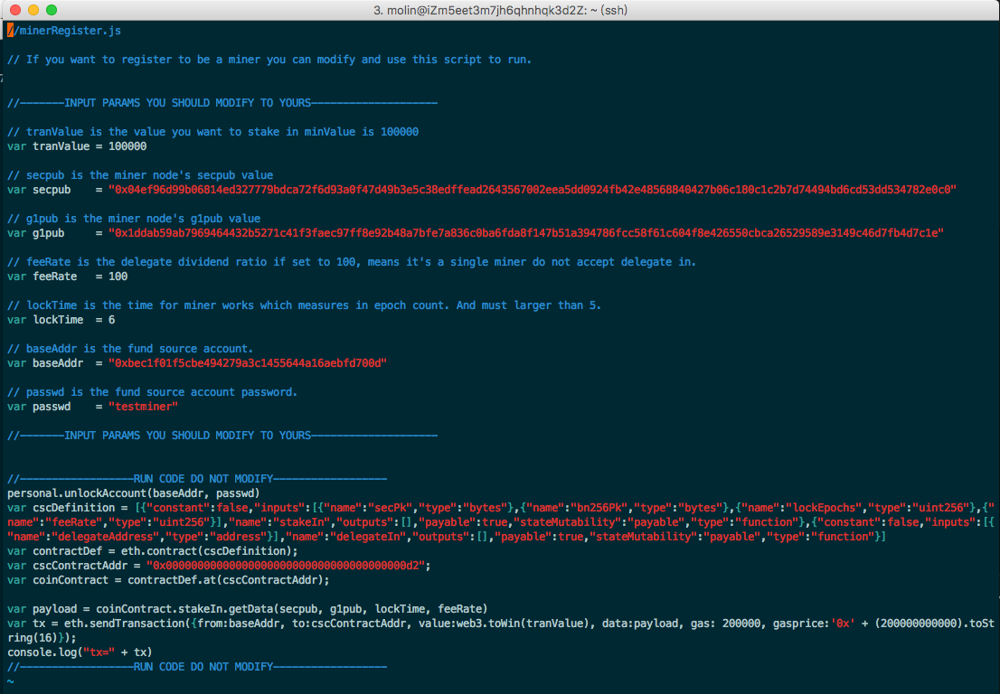
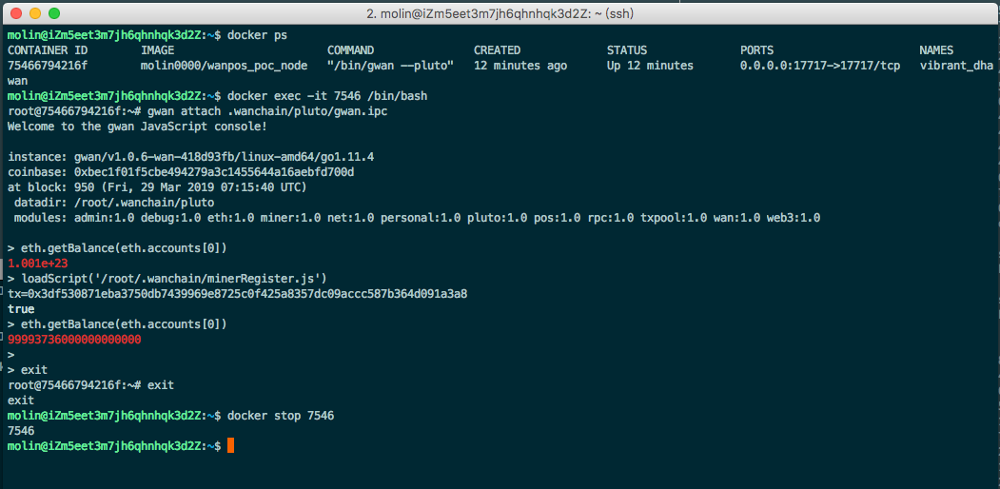
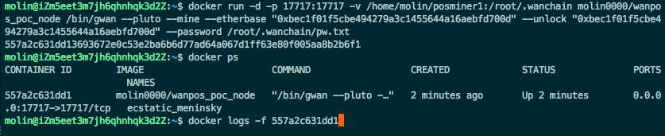
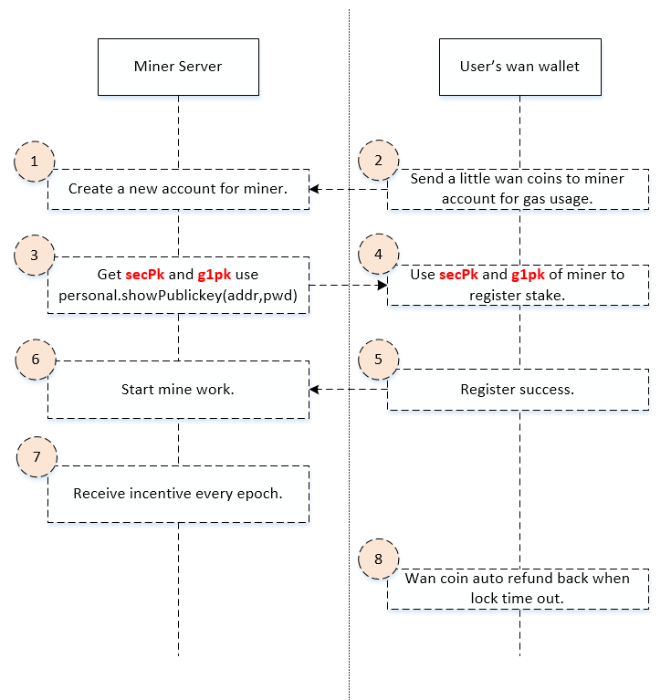

# 1. 万维链星系共识入门手册

# 2. 概述

参考入门手册可帮助您快速的接入星系共识，参与验证节点或代理。

参与者主要分为验证人和委托人两种角色。

验证人需要准备合适的节点服务器，在验证节点模式下运行，执行星系共识协议，并参与验证节点。

委托人不需要运行验证节点节点，可以选择投注到验证人，分享奖励。

Beta版的explorer地址为：

http://testnet.wanscan.org/

Wanstats地址为：

http://testnet.wanstats.io/

Faucet地址为：

http://54.201.62.90/

Beta相对于Alpha版主要更新内容包括（暂定）：

- Slot时间由10秒缩短为5秒
- Epoch时间由2天缩短为1天
- 委托费率取值范围从0 ~ 100更新为0 ~ 10000，精度更高（百分之几更新为万分之几）
- 验证节点可接受的最大委托上限从本金的5倍调整为10倍（1:10）
- docker镜像名称更新为：wanchain/client-go:2.0.0-beta.5
- 启动参数和指令中的pluto, 更换为testnet
- staking预编译合约地址更新


后续功能会陆续更新。

# 3. 目录

<!-- TOC -->

- [1. 万维链星系共识入门手册](#1-万维链星系共识入门手册)
- [2. 概述](#2-概述)
- [3. 目录](#3-目录)
- [4. 通过脚本启动节点](#4-通过脚本启动节点)
    - [4.1. 运行脚本创建并启动validator](#41-运行脚本创建并启动validator)
    - [4.2. 通过钱包注册验证节点](#42-通过钱包注册验证节点)
    - [4.3. 转少量交易费到验证节点](#43-转少量交易费到验证节点)
- [5. 通过Docker启动节点](#5-通过docker启动节点)
    - [5.1. 成为验证人](#51-成为验证人)
    - [5.2. 成为委托人](#52-成为委托人)
- [6. 其它的安装和运行方式](#6-其它的安装和运行方式)
    - [6.1. 使用代码编译运行](#61-使用代码编译运行)
    - [6.2. 运行教程](#62-运行教程)
        - [6.2.1. 同步节点](#621-同步节点)
        - [6.2.2. 验证节点](#622-验证节点)
- [7. 常用操作](#7-常用操作)
    - [7.1. 账号创建](#71-账号创建)
    - [7.2. 查询余额](#72-查询余额)
    - [7.3. 获取测试币](#73-获取测试币)
    - [7.4. Stake注册和代理流程](#74-stake注册和代理流程)
    - [7.5. 退本金方法](#75-退本金方法)
        - [7.5.1. 验证节点退本金](#751-验证节点退本金)
        - [7.5.2. 委托人退本金](#752-委托人退本金)

<!-- /TOC -->

# 4. 通过脚本启动节点

## 4.1. 运行脚本创建并启动validator

在ssh登录到云服务器后，执行如下命令：

```
wget https://raw.githubusercontent.com/wanchain/go-wanchain/develop/loadScript/deployValidator.sh && chmod +x deployValidator.sh && ./deployValidator.sh
```

脚本将提示您输入validator的名字，这个名字用作wanstats网站上的监控显示名称，不代表区块链浏览器上的名称。

脚本将提示您输入validator账号的密码。

脚本执行完成后，将反馈validator的账号地址和2个公钥，请将其完整备份下来供后续注册使用。

如果需要重启节点，请使用如下命令：

```
wget https://raw.githubusercontent.com/wanchain/go-wanchain/develop/loadScript/restartValidator.sh && chmod +x restartValidator.sh && ./restartValidator.sh
```

可以使用如下命令查看工作日志：

```
sudo docker logs -f gwan
```

停止日志查看按Ctrl-C

## 4.2. 通过钱包注册验证节点

接下来，可通过钱包完成validator注册行为

首先确保自己的本地轻钱包，或keystore账号中有足够的wan币，beta阶段为测试币，可接受委托的验证节点需要至少50000，不可接受委托的节点至少10000。并确认账户中除此之外还有足够的交易手续费。

在轻钱包上线之前，可通过web钱包注册：https://mywanwallet.io/

在轻钱包正式版上线后，推荐使用轻钱包注册，安全性更高。

(注意，如果使用wan wallet的助记词在mywanwallet上注册，需要在填写助记词时，密码位置需要留空)

在web钱包注册时，需要注意首先在右上角选取网络。beta阶段需要选择testnet网络。

点击Contract页面，选取Staking合约。

选取Access后，在下发选取StakeIn，完成节点注册。



！！！注意！！！

其中的`secPk`和`bn256Pk`即为上文中脚本执行完毕后返回的2个公钥。

其中`lockEpochs`为锁定时间，取值范围是7~90。

其中`feeRate`为佣金费率，取值范围是0~10000，代表0.00%~100.00%的佣金费率。

填写完成后，在下发选取钱包类型，并导入钱包。

锁定的金额，在下一页中输入。

按照提示操作，即可完成validator注册。

## 4.3. 转少量交易费到验证节点

在注册完成后，还需要转账少量交易手续费到验证节点地址，用于执行POS协议的手续费。

手续费消耗一般不超过0.01 wan每比交易，因此转50 wan币到验证人账号，便可支持较长时间的使用。

请定期通过浏览器检查验证人地址的余额，保证始终有交易费可用。

# 5. 通过Docker启动节点

如果已经通过脚本完成验证节点创建、启动和注册工作，则不需要再执行本章内容。

如果你想要更多定制化内容，可参考本章，通过docker启动节点。

## 5.1. 成为验证人

1） 安装 docker (Ubuntu):
```
$ sudo wget -qO- https://get.docker.com/ | sh

$ sudo usermod -aG docker YourUserName

$ exit
```

2）使用docker中的gwan创建keystore账号:

注意：下文中的YourUserName，YourContainerID，YourAccountAddress，YourPassword，YourPK1，YourPK2均为替代词，并不是命令本身，应根据实际情况，替换成自己的定制值；

- YourUserName：替换成你的用户名；
- YourContainerID：返回的DockerID，这个不是输入的，是返回的输出信息；
- YourAccountAddress：返回的创建好的地址；
- YourPassword：设定你的自定义的合适的密码；
- YourPK1、2：返回的你账号的2个公钥信息，注册validator时需要；

```
$ docker pull wanchain/client-go:2.1.1-beta

$ docker run -d -v /home/YourUserName/.wanchain:/root/.wanchain wanchain/client-go:2.1.1-beta /bin/gwan --testnet

YourContainerID

$ docker exec -it YourContainerID /bin/bash

root> gwan attach .wanchain/testnet/gwan.ipc

> personal.newAccount('YourPassword')

"YourAccountAddress"

> personal.showPublicKey("YourAccountAddress", 'YourPassword')

["YourPK1", "YourPK2"]

> exit

root> echo "YourPassword" > /root/.wanchain/pw.txt

root> exit

```


3）为您的测试账号申请测试币 "YourAccountAddress"。

申请测试币请填写下方的信息表格。

http://wanchain.mikecrm.com/USjDMuk

如果已经使用钱包账号申请过测试币，可以手动将测试币转账到上文创建的validator账号中，完成后续步骤。

4） 验证节点注册

使用社区开发的[mywanwallet](https://mywanwallet.io/#contracts)网页版钱包以可视化的方式完成验证人注册。也可以按照下文方式使用脚本注册。

！！！注意！！！为了保障账户安全，在使用脚本注册时，请一定不要开启--rpc选项，请反复核查后继续。（推荐使用钱包注册）

创建一个验证节点注册脚本文件: `/home/YourUserName/.wanchain/validatorRegister.js`


```
//validatorRegister.js

// If you want to register to be a miner you can modify and use this script to run.


//-------INPUT PARAMS YOU SHOULD MODIFY TO YOURS--------------------

// tranValue is the value you want to stake
// non-delegate mode validator - minValue is 10000
// delegate mode validator - minValue is 50000  
var tranValue = "50000"

// secpub is the miner node's secpub value
var secpub    = "YourPK1"

// g1pub is the miner node's g1pub value
var g1pub     = "YourPK2"

// feeRate is the delegate dividend ratio if set to 10000, means it's a single miner do not accept delegate in.
// range 0~10000 means 0%~100%
var feeRate   = 1000

// lockTime is the time for miner works which measures in epoch count. And must >= 7 and <= 90.
var lockTime  = 30

// baseAddr is the fund source account.
var baseAddr  = "YourAccountAddress"

// passwd is the fund source account password.
var passwd    = "YourPassword"

//-------INPUT PARAMS YOU SHOULD MODIFY TO YOURS--------------------


//------------------RUN CODE DO NOT MODIFY------------------
personal.unlockAccount(baseAddr, passwd)
var cscDefinition = [{"constant":false,"inputs":[{"name":"addr","type":"address"},{"name":"lockEpochs","type":"uint256"}],"name":"stakeUpdate","outputs":[],"payable":false,"stateMutability":"nonpayable","type":"function"},{"constant":false,"inputs":[{"name":"addr","type":"address"}],"name":"stakeAppend","outputs":[],"payable":true,"stateMutability":"payable","type":"function"},{"constant":false,"inputs":[{"name":"secPk","type":"bytes"},{"name":"bn256Pk","type":"bytes"},{"name":"lockEpochs","type":"uint256"},{"name":"feeRate","type":"uint256"}],"name":"stakeIn","outputs":[],"payable":true,"stateMutability":"payable","type":"function"},{"constant":false,"inputs":[{"name":"delegateAddress","type":"address"}],"name":"delegateIn","outputs":[],"payable":true,"stateMutability":"payable","type":"function"},{"constant":false,"inputs":[{"name":"delegateAddress","type":"address"}],"name":"delegateOut","outputs":[],"payable":false,"stateMutability":"nonpayable","type":"function"}];


var contractDef = eth.contract(cscDefinition);
var cscContractAddr = "0x00000000000000000000000000000000000000DA";
var coinContract = contractDef.at(cscContractAddr);

var payload = coinContract.stakeIn.getData(secpub, g1pub, lockTime, feeRate)
var tx = eth.sendTransaction({from:baseAddr, to:cscContractAddr, value:web3.toWin(tranValue), data:payload, gas: 200000, gasprice:'0x' + (200000000000).toString(16)});
console.log("tx=" + tx)
//------------------RUN CODE DO NOT MODIFY------------------

```





脚本中的FeeRate字段为验证人接受委托投注时的分红比例。如果设为100，则表示不接受委托。

设为10，则表示验证人独享总收益的10%后，再与委托人按金额比例分红。

5） 在gwan中执行脚本

如果第二步的docker没有关闭，可以直接按下述代码进入执行，如果已关闭，请再启动起来: 

```
$ docker exec -it YourContainerID /bin/gwan attach .wanchain/testnet/gwan.ipc

> loadScript("/root/.wanchain/validatorRegister.js")

> exit

$ docker stop YourContainerID

$ docker run -d -p 17717:17717 -p 17717:17717/udp -v /home/YourUserName/.wanchain:/root/.wanchain wanchain/client-go:2.1.1-beta /bin/gwan --testnet --etherbase "YourAccountAddress" --unlock "YourAccountAddress" --password /root/.wanchain/pw.txt --mine --minerthreads=1 --wanstats your-node-name:admin@testnet.wanstats.io

```

其中参数中的“--wanstats your-node-name:admin@54.193.4.239:80”部分是PoS beta测试用于统计节点和PoS网络运行情况的。

“your-node-name”请自定义为您想要的节点名称，例如“Community-WAN-node_EMEA1”，请避免使用大小写字母，数字，“-”，“_”以外的字符，例如空格。

您可以通过WanStats网站来查看这些信息，Beta测试阶段WanStats的网址为：http://testnet.wanstats.io

执行完上述脚本，即可完成开启验证节点运行。

可通过:
```
docker logs -f `docker ps -q`
```
命令查看工作日志。

验证节点工作，将在所有块同步完成后正式开始。当前测试网数据较大，同步时间可能需要几个小时，请耐心等待。






## 5.2. 成为委托人

可通过Wan Wallet轻钱包方便的完成委托投注。

轻钱包下载地址：https://github.com/wanchain/wan-wallet-desktop/releases

也可按照如下命令执行投注。

1）安装 docker (Ubuntu):
```
$ sudo wget -qO- https://get.docker.com/ | sh

$ sudo usermod -aG docker YourUserName

$ exit
```

2）创建账号，查找验证人信息:

验证人信息可以通过命令行查找，也可以通过浏览器查找。请注意，在使用pos.getStakerInfo获取验证节点信息前，请确认当前已经同步到最新块。可通过eth.blockNumber来查看。

```
$ docker run -d -v /home/YourUserName/.wanchain:/root/.wanchain wanchain/client-go:2.1.1-beta /bin/gwan --testnet

YourContainerID

$ docker exec -it YourContainerID /bin/bash

root> gwan attach .wanchain/testnet/gwan.ipc

> personal.newAccount('YourPassword')

"YourAccountAddress"

> pos.getStakerInfo(eth.blockNumber)
[
	{...},
	{...},
	{	Address: "DelegateAddress",
    Amount: 2e+23,
    Clients: [],
    FeeRate: 10,
    From: "...",
    LockEpochs: 30,
    PubBn256: "...",
    PubSec256: "...",
    StakingEpoch: 117
	}
]
```

通过上述执行，得到本地账号 `YourAccountAddress` 和想要投注的具备理想`FeeRate`的验证人地址 `DelegateAddress`.

3）申请测试币（方法同上）


4）创建投注脚本 `/home/YourUserName/.wanchain/sendDelegate.js`

```
//sendDelegate.js

// If you want to send to a delegate you can modify and use this script to run.


//-------INPUT PARAMS YOU SHOULD MODIFY TO YOURS--------------------

// tranValue is the value you want to stake in minValue is 100
var tranValue = "100000"

// delegateAddr is the validator address.
var delegateAddr = "DelegateAddress"

// baseAddr is the fund source account.
var baseAddr  = "YourAccountAddress"

// passwd is the fund source account password.
var passwd    = "YourPassword"

//-------INPUT PARAMS YOU SHOULD MODIFY TO YOURS--------------------


//------------------RUN CODE DO NOT MODIFY------------------
personal.unlockAccount(baseAddr, passwd)
var cscDefinition = [{"constant":false,"inputs":[{"name":"addr","type":"address"},{"name":"lockEpochs","type":"uint256"}],"name":"stakeUpdate","outputs":[],"payable":false,"stateMutability":"nonpayable","type":"function"},{"constant":false,"inputs":[{"name":"addr","type":"address"}],"name":"stakeAppend","outputs":[],"payable":true,"stateMutability":"payable","type":"function"},{"constant":false,"inputs":[{"name":"secPk","type":"bytes"},{"name":"bn256Pk","type":"bytes"},{"name":"lockEpochs","type":"uint256"},{"name":"feeRate","type":"uint256"}],"name":"stakeIn","outputs":[],"payable":true,"stateMutability":"payable","type":"function"},{"constant":false,"inputs":[{"name":"delegateAddress","type":"address"}],"name":"delegateIn","outputs":[],"payable":true,"stateMutability":"payable","type":"function"},{"constant":false,"inputs":[{"name":"delegateAddress","type":"address"}],"name":"delegateOut","outputs":[],"payable":false,"stateMutability":"nonpayable","type":"function"}];


var contractDef = eth.contract(cscDefinition);
var cscContractAddr = "0x00000000000000000000000000000000000000DA";
var coinContract = contractDef.at(cscContractAddr);

var payloadDelegate = coinContract.delegateIn.getData(delegateAddr)
var tx2 = eth.sendTransaction({from:baseAddr, to:cscContractAddr, value:web3.toWin(tranValue), data:payloadDelegate, gas: 200000, gasprice:'0x' + (200000000000).toString(16)});
console.log("tx2=" + tx2)
//------------------RUN CODE DO NOT MODIFY------------------
```

5）在gwan中运行投注脚本

```
$ docker exec -it YourContainerID /bin/bash

root> gwan attach .wanchain/testnet/gwan.ipc

> loadScript("/root/.wanchain/sendDelegate.js")

```

委托人投注完成。


# 6. 其它的安装和运行方式

## 6.1. 使用代码编译运行

需要提前安装和配置golang运行环境：https://golang.org/

配置环境变量 $GOPATH 和 $GOROOT:

从github获取最新代码：

```
$ mkdir -p $GOPATH/src/github.com/wanchain/

$ cd $GOPATH/src/github.com/wanchain/

$ git clone https://github.com/wanchain/go-wanchain.git

$ cd go-wanchain

$ git checkout betarelease

$ git pull

$ make
```

编译得到的gwan在此目录下： `build/bin/gwan`

## 6.2. 运行教程

可在如下不同角色下运行：

### 6.2.1. 同步节点

```
$ gwan --testnet --syncmode "full"
```

### 6.2.2. 验证节点

在下面命令中请替换地址为您的个人地址 `0x8d8e7c0813a51d3bd1d08246af2a8a7a57d8922e` ，并替换 `/tmp/pw.txt` 为您地址的密码文本文件。

```
$ gwan --testnet --etherbase "0x8d8e7c0813a51d3bd1d08246af2a8a7a57d8922e" --unlock "0x8d8e7c0813a51d3bd1d08246af2a8a7a57d8922e" --password /tmp/pw.txt  --mine --minerthreads=1 --syncmode "full"
```

# 7. 常用操作

## 7.1. 账号创建


```
$ gwan --testnet account new
```


执行上述命令后，keystore文件会存储在默认目录 `~/.wanchain/testnet/keystore/` in Ubuntu 或者 `~/Library/Wanchain/testnet/keystore/` in Mac OS.

使用如下命令获取两个星系共识需要用到的公钥。

```
$ gwan --testnet account pubkeys 'Your Address' 'Your Password'
```

星系共识需要使用key1和key3，作为SecPk和G1PK。

## 7.2. 查询余额


```
// In ubuntu
$ gwan attach ~/.wanchain/testnet/gwan.ipc

// In MacOS
$ gwan attach ~/Library/Wanchain/testnet/gwan.ipc

```

在链同步完成后，可通过下面指令查询余额。

```
$ eth.getBalance("Your Address Fill Here")

// Such as address example shown above.
$ eth.getBalance("0x8c35B69AC00EC3dA29a84C40842dfdD594Bf5d27")
```

## 7.3. 获取测试币

验证节点请在网页中填表申请测试币。（地址）

普通委托人请通过faucet申请少量测试币。[Wanchain-Faucet](http://54.201.62.90/)

其它技术支持信息，还可以邮件联系。

或加入官网上的Gitter/QQ/微信社区群。

www.wanchain.org

| Index            | Email         | 
| --------------  | :------------  | 
|1| techsupport@wanchain.org| 


## 7.4. Stake注册和代理流程

用户注册一个节点服务器为星系共识验证节点的步骤如下图所示：



## 7.5. 退本金方法

### 7.5.1. 验证节点退本金

验证人可使用[stakeUpdate.js](https://github.com/wanchain/go-wanchain/blob/develop/loadScript/stakeUpdate.js)脚本，将locktime设成0，来实现退款。本金将在下个周期开始时，自动退回来源账户。

默认情况下，验证人会自动续期。需要手动操作才能退本金。


### 7.5.2. 委托人退本金

通过钱包投注的委托人，可直接通过钱包的退款按钮退款。

通过脚本注册的委托人，可通过[delegateOut.js](https://github.com/wanchain/go-wanchain/blob/develop/loadScript/delegateOut.js)脚本完成退本金操作。

