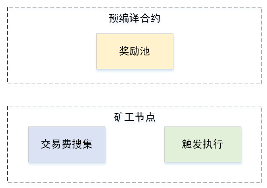
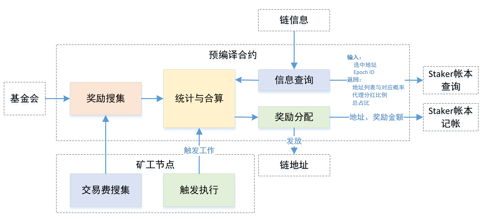
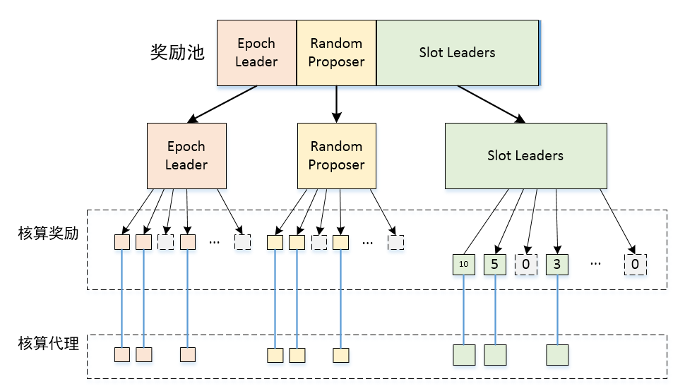

# 奖励机制设计与实施方案

目  录
<!-- TOC -->

- [奖励机制设计与实施方案](#奖励机制设计与实施方案)
  - [1、概述](#1概述)
  - [2、实施计划](#2实施计划)
  - [3、待明确问题](#3待明确问题)
    - [1） 奖励分配方式：](#1-奖励分配方式)
    - [2） 奖励池中未花完的奖励份额如何处理](#2-奖励池中未花完的奖励份额如何处理)
    - [3） 奖励到账时间](#3-奖励到账时间)
    - [4） 奖励发放时机](#4-奖励发放时机)
    - [5） 奖励池资金来源](#5-奖励池资金来源)
  - [4、功能模块组成](#4功能模块组成)
  - [5、接口设计](#5接口设计)
    - [1）基金会注资接口](#1基金会注资接口)
    - [2）链查询接口](#2链查询接口)
    - [3）触发执行接口](#3触发执行接口)
    - [4）交易费搜集接口](#4交易费搜集接口)
    - [5）Stake账本查询接口](#5stake账本查询接口)
    - [6）Stake账本记账接口](#6stake账本记账接口)
  - [6、功能模块设计](#6功能模块设计)
    - [1）奖励搜集](#1奖励搜集)
    - [2）统计与合算](#2统计与合算)
    - [3）信息查询](#3信息查询)
    - [4）奖励分配](#4奖励分配)
    - [5）交易费搜集](#5交易费搜集)
    - [6）触发执行](#6触发执行)
  - [7、工作流程设计](#7工作流程设计)
  - [8、问题记录与解决方案](#8问题记录与解决方案)

<!-- /TOC -->


## 1、概述
----

奖励机制目的是奖励POS协议的执行人，奖励交易执行人，奖励保持在线并出块的持股人。并通过各种机制来达到：“作恶的人没有机会通过作恶而得到更高的奖励”，以保证理性的参与者不会作恶。

## 2、实施计划
----

按照如下几个步骤执行：

| 序号            | 事项            | 时间节点             | 状态
| --------------  | :------------  | :-------------: | :--: |
|1|梳理奖励机制待明确的问题，讨论并明确实施方向；| 02-28 |已完成
|2|明确功能模块组成与对外提供的接口，完成修改方案草稿；| 03-01|已完成
|3|完成功能代码及单元测试脚本的开发| 03-08|已完成
|4|搭建测试环境进行测试验证与联试| 03-15|已完成
|5|代码review与回归修改|03-22|已完成

## 3、待明确问题
----

主要包括：

| 序号 | 内容 | 状态
| --- | :---: | :---: |
|1|奖励分配方式| 已明确
|2|奖励池剩余额度分配|已明确
|3|奖励到账时间|已明确
|4|奖励发放时机|已明确
|5|奖励池资金来源|已明确


### 1） 奖励分配方式：
- A）独立分配给每个人：
- B）先全部分配给代理，再由代理线下分配：
- C）将奖励记账到代理人名下，在持股人unlock stake的时候，由预编译合约来分配；
- D）在奖励延迟合算完成后，立即分配，并在staker中记账；
```
因为当前的slot选取机制只选Stake大于1%（或2%等设定门限）的人或代理人来出块，无法定位到每一个持股人，所以只能将奖励分配给代理后，由代理人统一按比例分配。

采用方案D）

同时，建议添加查询接口，方便每个持股人随时查询当前已获取到的收益。

需要注意，收益到代理后，先去除天花板收益损耗，再去除代理分层，然后按stake分配；
```

### 2） 奖励池中未花完的奖励份额如何处理

- A） 直接烧掉；
- B） 回归基金会某个指定账户；
- C） 奖金向后累积，提升后面奖励池的额度发放给后面的人；
- D） 随机奖励给持股人（搞定期抽奖活动）；
- E） 剩余奖励资金不从总奖励池账户中扣除，累积提升可发奖励年限；

```
方案A：直接烧掉
优点：总币量减少，使所有人获益。
缺点：可能没人关心这个，币总量减少了，社区也没拿到奖励。

方案B：回归基金会账户
缺点：这样分配可能存在对外解释的问题；回归到的大额账户可能存在安全问题。还可能使社区产生攻击其它节点的动机。
优点：可确保作恶的人不会有收益。可奖励社区开发。

方案C：奖金向后累积，提升后面奖励池的额度发放给后面的人
优点：可鼓励后续的参与人，提高收益。
缺点：后续参与人可能也包含是作恶人，使作恶人后续收益提高。会使理性节点产生攻击他人的动机。

方案D：随机奖励给持股人（搞定期抽奖活动）
优点：使所有人受益，提升参与积极性，提高关注度；
缺点：收益不可控，做恶人也可能受益；

方案E：理论团队：剩余奖励资金不从总奖励池账户中扣除，累积提升可发奖励年限
此方案对应于问题5的方案B
优点：可延长奖励发放总年限；
缺点：同问题5缺点；

选C）每5年重新根据剩余总奖金池核算应发金额；

```

### 3） 奖励到账时间

- A） Stake锁定时间到期后提取时一次性到账；
- B） 每次有了奖励立即到账，合算完成后由矿工自动发放；

```
按照前文1中的讨论，选取方案B）。在一个固定的延迟后合算并立即发放。

另外用户锁定时间到达后，再过2个epoch才能取出资金。为了方便续期，可提供自动续期接口以及取消自动续期接口。
```

### 4） 奖励发放时机

- A） 在矿工打包块和其它节点验证块时，触发预编译合约进行核算和发放；
- B） 固定在epoch开头进行统一核算和发放；

```
为防止因某块未出而导致奖励发放异常，在每个块中触发预编译合约执行，核算并发放奖励。但此执行过程每个epoch只执行一次，后续的触发机会只用来保证每个epoch必然执行，如果已经执行过，则不作处理直接返回。可视为A与B方案的结合方案。
```

### 5） 奖励池资金来源

- A） 直接将10%预留资金烧掉，然后在代码中按规则生成奖励池资金直接发放到账户；
- B） 建立一个总奖励池账户（预编译合约），定期将资金转入该地址中，用于每次奖励时共识扣款；
```
对于A方案
优点：可保证资金不会被挪用，账户不会被盗取，不存在安全性问题；
缺点：如果编码过程中出现bug，无法保证WAN币的总额不变，可能出现凭空多出很多钱，或少很多钱的意外情况；

对于B方案
优点：可保证WAN币总额不变，避免代码bug导致多出大量资金；奖励池账户（预编译合约）即使被盗，也只是部分损失，不是全部损失；
缺点：保有10%的资金来源账号存在被盗风险，或私钥遗失风险；人工参与度较高；

考虑使用方案A。当前10%资金就不在链上。

```

## 4、功能模块组成
----

功能主要分为预编译合约和矿工节点两部分。如下图所示：



更进一步，按功能进行分解后，如下图所示：



如上图所示，奖励池部分可划分为如下6个部分：

- 奖励搜集：搜集基金会资金和交易费，计算每个epoch奖励份额；
- 统计与合算：根据活跃度、地址、概率、分红比例、资金总占比等进行奖金合算与分配；
- 信息查询：查询链信息，获取矿工地址、协议执行人地址、活跃度等信息，根据地址查询地址的代理情况、分红比例和总占比；
- 奖励分配：根据合算结果，向Stake账本写入每个地址的奖励记账信息；

矿工节点部分主要划分为如下2个部分：

- 交易费搜集：在矿工执行交易时，搜集所有交易费，统一发给奖励池接口；
- 触发执行：每个矿工出块时、其它节点验块时触发执行奖励合算与发放，每个epoch只需执行一次；


## 5、接口设计
----

接口为上图中外部的6个箭头。主要分为：

- 基金会注资接口
- 交易费搜集接口
- 触发执行接口
- 链查询接口
- Stake账本查询接口
- Stake账本记账接口

### 1）基金会注资接口

当前方案采用基金会直接烧掉一定资金，然后在奖励时代码生成资金的方式来达到资金均衡的目的。

### 2）链查询接口

链查询接口仅需要当前的StateDB。

### 3）触发执行接口

触发执行接口在矿工打包块的时候，其它节点验块的时候触发执行。需要StateDB的实例来进行访问和数据写入。

```
// File: consensus.go Line: 81
// Finalize runs any post-transaction state modifications (e.g. block rewards)
// and assembles the final block.
// Note: The block header and state database might be updated to reflect any
// consensus rules that happen at finalization (e.g. block rewards).
Finalize(chain ChainReader, header *types.Header, state *state.StateDB, txs []*types.Transaction,
  uncles []*types.Header, receipts []*types.Receipt) (*types.Block, error)

```

输入参数：

- StateDB

- epochID

输出参数：

- 成功/失败

### 4）交易费搜集接口

交易费接口，搜集原本奖励给矿工的交易费，用于奖励池统一发放。

原交易费搜集代码位置如下：

```
\\ File: core/state_transaction.go, Line: 311
st.state.AddBalance(st.evm.Coinbase, new(big.Int).Mul(usedGas, st.gasPrice))
```

将这行代码进行替换。替换成预编译合约中提供的奖励搜集函数调用。

输入参数：

- 交易费金额

返回参数：

- 无

`注意：这里需要验证一下，如果AddBalance的地址不存在，它是否会自动创建。`


### 5）Stake账本查询接口

Stake账本查询接口，调用Staker模块提供的接口实现：

输入参数：

- 地址
- epochID

返回参数：

- 数据结构数组，包括地址和对应的概率值：{addr string, probility *big.Int}，类似于：
```
[{地址，概率},{地址，概率},{地址，概率},{地址，概率},{地址，概率},{地址，概率},{地址，概率}]
其中第一个地址对应代理地址。
```
- 代理分红比例(如果分红比例为100%，则为独立运行节点，不代理别人),取值范围1~100
- 总占比，总概率之和

### 6）Stake账本记账接口

Stake账本记账接口用于记录收益数量到每一个收益地址中。调用Staker模块提供的接口实现。

输入参数：

- 数据结构二维数组，包括每个代理及其对应金额的列表。类似于：
```
[
[{地址，金额},{地址，金额},{地址，金额},{地址，金额}],
[{地址，金额},{地址，金额}],
[{地址，金额},{地址，金额},{地址，金额}],
]
```
其中每行的第一个地址为代理地址。

## 6、功能模块设计
----


### 1）奖励搜集

奖励机制的奖金池来源主要分为2部分：基金会预留的10%挖矿奖励资金和链上执行的所有交易的Gas Fee交易费。

其中基金会部分第一个5年发放5%，之后每个5年奖励减半。

因此第一个5年中，每年的奖励为：
```
P = 2100万 * 50% / 5年 = 210 万/年
```

总奖金为：


a为第1个5年奖励：a = 210 万

b = 50%

从第二个5年开始，除原有奖金池外，还加入了上一个5年未发完的剩余金额，因此第二个5年中，每年的奖励为：
```
P = (2100万 * 50% * 50% + S) / 5年 = (105 + a) 万 / 年
```

其中S为上一个5年的剩余奖励。a为核算后每年多出的奖励。

第n年的奖励为：(n ∈ [0,1,2,3,4,5,6,7,8,9...])
```
P = ( a * pow(b, floor(n / 5)) + S ) / 5
```
因此每个epoch应发的奖励总额应为：
```
G = P / N + T
```
其中N为1年内epoch总数，T为epoch内的搜集到的总交易费。

每个epoch奖励执行完成后，记录实际支出的奖励金额，用于5年后核算总奖励剩余使用。

或可参考BTCD（bitcoin的Go语言客户端）代码，计算奖励如下：
```
// CalcBlockSubsidy returns the subsidy amount a block at the provided height
// should have. This is mainly used for determining how much the coinbase for
// newly generated blocks awards as well as validating the coinbase for blocks
// has the expected value.
//
// The subsidy is halved every SubsidyReductionInterval blocks.  Mathematically
// this is: baseSubsidy / 2^(height/SubsidyReductionInterval)
//
// At the target block generation rate for the main network, this is
// approximately every 4 years.
func CalcBlockSubsidy(height int32, chainParams *chaincfg.Params) int64 {
	if chainParams.SubsidyReductionInterval == 0 {
		return baseSubsidy
	}

	// Equivalent to: baseSubsidy / 2^(height/subsidyHalvingInterval)
	return baseSubsidy >> uint(height/chainParams.SubsidyReductionInterval)
}
```
为： P = 基础奖励 / (2^(块高/半衰期))

这里为了适配WanPoS协议，将块高替换成epochID。

此模块提供接口供交易费注入。

除法除不尽的零头，返回总奖金池，累加到下一个5年进行发放。

### 2）统计与合算

统计与合算根据输入信息，计算出分配到每一个奖励地址的具体奖励份额。

三种被奖励的角色分别为：Epoch Leader，Random Proposer，Slot leaders。

统计与合算分如下10步执行，奖励池指待奖励epoch的奖励池，下文对3、5步骤进行详细说明：

1. 计算奖励池中属于基金会的部分金额；

2. 获取奖励池中交易费金额，并与上一步相加得到epoch总奖励池；

3. 按3种角色获取地址列表和对应的活跃度信息；

4. 将总奖励按3种角色所占奖金比例系数分成3份，分别完成奖励计算；

5. 根据stake总份额和天花板系数，进一步合算奖励金额，扣除应扣部分；

6. 根据是否为代理扣除代理手续费；

7. 根据地址及地址的概率值，按比例分配剩余奖金额度；

8. 累加验证总金额是否正确；（如果验证失败了怎么办？）

9. 剩余部分返回总奖励池；

10. 调用记账接口进行记账分发奖励。

实际编码时可按照操作类型进行适当归类。

其中，第3步获取地址列表和活跃度时，需要注意slot leaders的地址列表中要包含每个地址的出块次数，并且其活跃度为总值。其余两种角色的活跃度与每个地址相关联。

第5步要先按第3、4步地址分配好对应的奖励值后，再针对每一个地址使用总份额合算天花板系数，扣除多余奖励。下一步计算代理利益分配，是在这个地址奖励值的基础上进行合算和分配。



### 3）信息查询

信息查询需要从链上和Staker模块获取必要的信息，信息主要包括如下内容：

1. 统计epoch内每个出块人，统计地址列表及出块次数，及epoch出块活跃度；

2. 统计协议交易信息，获取epoch leader和random proposer信息及活跃度；

3. 通过地址查询总stake占比；

4. 查询代理费率，被代理人列表及概率；

### 4）奖励分配

奖励合算完成后，直接将奖金打入地址中。使用AddBalance函数增加每个待分配地址的余额。

另外，要从奖励池中烧掉基金会部分的wan币。Transfer到0地址。

在奖励发放前后要分别校验发放金额是否正确合理。

调用Staker提供的记账接口在Staker中进行奖励记账。

### 5）交易费搜集

交易费搜集使用函数将交易费金额写入stateDB，使用预编译合约地址和epochID作为索引。

在每次写入时，先获取原值，进行累加之后再次写入。

可提考虑供接口供事后查询。

### 6）触发执行

在矿工节点打包块时，触发执行奖励合算与发放。

在其余节点验证块时，触发执行奖励合算与发放。

## 7、工作流程设计

----

由Coinbase交易触发统计与合算，搜集信息完成处理流程。流程可参考第第2节。[2）统计与合算](#2统计与合算)


## 8、问题记录与解决方案

| 序号            | 问题            | 解决方法             | 状态
| --------------  | :------------  | :-------------: | :--: |
|1|同步节点（不挖矿）在同步到102块时merkle root不匹配| 获取epochID方式存在问题，只在挖矿节点有效 | 已修改
|2|同步节点在同步的201块时，merkle root不匹配| |
|3|无法正常获取随机数rb| |