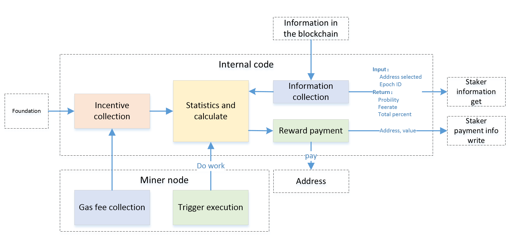
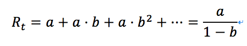
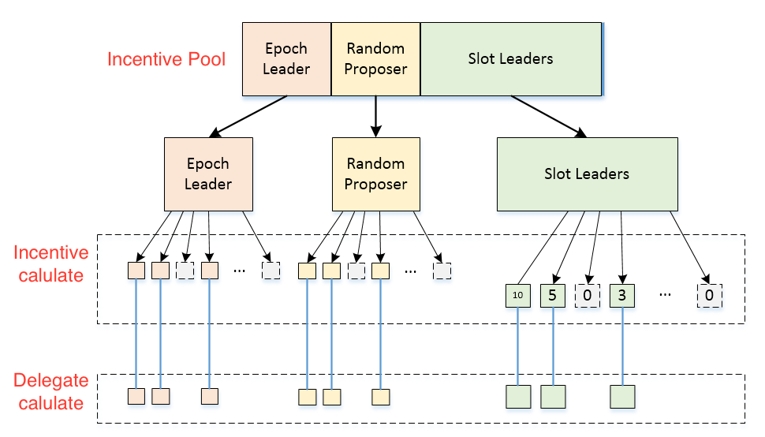
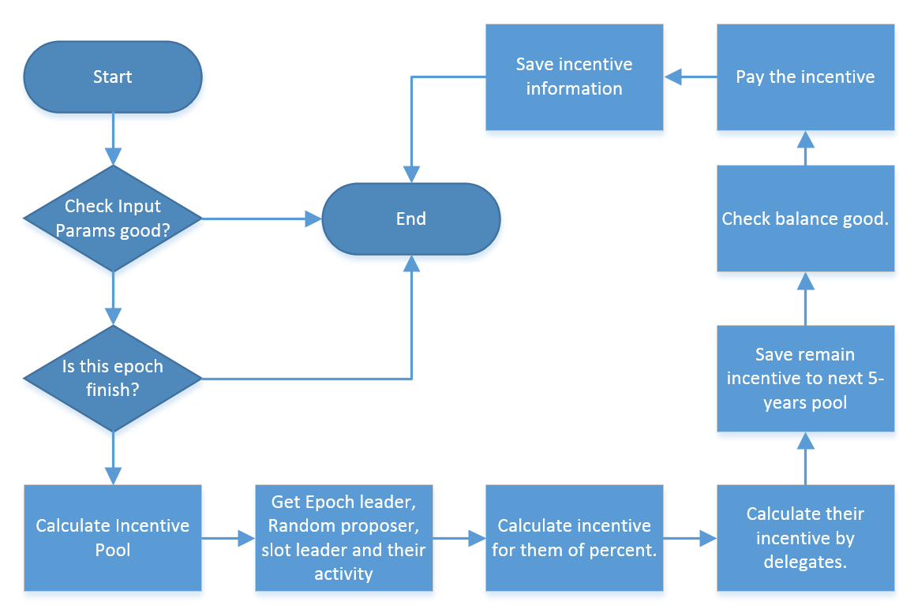

# 1. Incentive mechanism design 

# 2. Contents

<!-- TOC -->

- [1. Incentive mechanism design](#1-incentive-mechanism-design)
- [2. Contents](#2-contents)
- [3. Overview](#3-overview)
- [4. Role division](#4-role-division)
- [5. The key issue](#5-the-key-issue)
    - [5.1. Reward distribution method:](#51-reward-distribution-method)
    - [5.2. How to deal with the bonus share that has not been spent in the reward pool](#52-how-to-deal-with-the-bonus-share-that-has-not-been-spent-in-the-reward-pool)
    - [5.3. Reward arrival time](#53-reward-arrival-time)
    - [5.4. Reward time](#54-reward-time)
    - [5.5. Reward pool funding source](#55-reward-pool-funding-source)
    - [5.6. Participation time plan](#56-participation-time-plan)
    - [5.7. Funding plan](#57-funding-plan)
    - [5.8. Benefits change over time](#58-benefits-change-over-time)
    - [5.9. Multi-account support](#59-multi-account-support)
- [6. Functional module](#6-functional-module)
- [7. Interface design](#7-interface-design)
    - [7.1. Foundation funding interface](#71-foundation-funding-interface)
    - [7.2. Transaction fee collection interface](#72-transaction-fee-collection-interface)
    - [7.3. Trigger execution interface](#73-trigger-execution-interface)
    - [7.4. Chain Query Interface](#74-chain-query-interface)
    - [7.5. Stake Information Query Interface](#75-stake-information-query-interface)
    - [7.6. Stake Account Information save interface](#76-stake-account-information-save-interface)
- [8. Functional module design](#8-functional-module-design)
    - [8.1. Incentive collection](#81-incentive-collection)
    - [8.2. Statistic and calculation](#82-statistic-and-calculation)
    - [8.3. Information collection](#83-information-collection)
    - [8.4. Reward payment](#84-reward-payment)
    - [8.5. Gas fee collection](#85-gas-fee-collection)
    - [8.6. Trigger execution](#86-trigger-execution)
- [9. Workflow design](#9-workflow-design)

<!-- /TOC -->

# 3. Overview

The purpose of the reward mechanism is to reward the executor of the POS agreement. Reward the executor of the transaction, and reward the shareholders who remain online and out of the block. And through various mechanisms to achieve: "The evildoer has no chance to get a higher reward by doing evil" to ensure that rational participants will not do evil.

# 4. Role division

The current roles are clearly defined as follows:

- RNP (Random Number proposer): 25, all open; responsible for executing the random number generation protocol (DKG1/DGK2/SIGN);

- EL (Epoch Leader): 50, of which the Foundation controls 26 (no rewards) and 24 are open to the public; it is responsible for implementing the Slot Leader Selection Agreement (SMA1/SMA2);

- SL (Slot Leader): randomly selected from the EL, responsible for the block;

Among them, RNP and EL selection probability are related to the stake and lock time; SL is a subset of EL, and the probability of being selected in EL is equal;

In order to ensure that the benefits of RNP and EL are the same, the distribution ratio is proportional to the number of people selected.

Namely: RNP: (25/49), EL: (24/49).

The EL reward will be further 1:1 assigned to the SL. After combining the SL in the EL, the bonus pool allocation ratio for each character is:

- RNP: (25/49)
- EL: (12/49)
- SL: (12/49)

# 5. The key issue

## 5.1. Reward distribution method:
```
Rewards are automatically calculated and issued by consensus codes.

In the first year, the total prize money is 2.5 million Wan, and the annual decline is 88%.

In the 2k slot position of each Epoch, rewards are awarded and distributed, and the bonus is immediately paid.
```

## 5.2. How to deal with the bonus share that has not been spent in the reward pool
```
The bonus will be accumulated backwards, and the amount of the reward pool will be increased to the latter.

After each year, the account shall be re-calculated according to the remaining total prize pool;
```

## 5.3. Reward arrival time
```
Each epoch reward is cost-effective and immediately issued at the 2k slot position of the next epoch.

After the user lock time arrives, the locked funds will be automatically returned to the original account after 2k slots.
```

## 5.4. Reward time

```
In order to prevent the exception of rewards due to a certain block, the consensus code execution is triggered in each block, and the rewards are issued and issued. However, this epoch is only executed once for each execution. The subsequent triggering opportunities are only used to ensure that each epoch is executed inevitably. If it has been executed, it will be returned without processing. Can be considered as a combination of A and B programs.
```

## 5.5. Reward pool funding source

- A) directly burn out 10% of the reserved funds or burn them in batches, and then directly generate the reward pool funds in the code to the account;
- B) Create a total reward pool account (pre-compiled contract) and transfer funds to the address on a regular basis for a consensus deduction for each award;
- C) does not burn, is generated directly in the code;
```
For the A plan
Advantages: It can guarantee that funds will not be misappropriated, accounts will not be stolen, and there are no security problems;
Disadvantages: If there is a bug in the encoding process, there is no guarantee that the total amount of WAN currency will remain the same, and there may be unexpected situations where there is a lot of money out of thin air, or less money;

For the B plan
Advantages: The total amount of WAN currency can be kept constant, and the code bug can be prevented from causing a large amount of funds; the reward pool account (pre-compiled contract) is only partially lost, not all losses, even if it is stolen;
Disadvantages: 10% of the funds source account has the risk of being stolen, or the risk of losing the private key; the human participation is higher;

Currently adopting C. It is decided to use A or B before the formal launch.

```

## 5.6. Participation time plan

```
Users can choose to participate in the implementation: XXX days, XXX month, XXX months, XXX months.

Or custom choice: any value between XXX days and XXX days.

The time selected by the user is the real benefit time. In addition, there is a certain waiting time before and after, which is used to ensure information stability.
```

```
There is a XXX to XXX day waiting time before the user officially begins to calculate the return.

There is a XXX-day refund waiting time after the user expires.

For users who want to quit early (client), there is a XXX day exit waiting time.

No gains are calculated for all waiting times.
```

## 5.7. Funding plan

1. Minimum lock amount limit
```
Become a normal miner node: XXX wan

Become a proxy miner node: XXX wan

Principal Investment Agent: XXX wan

```

2. Multiple account investment restrictions
```
Investors can invest in the same miner node through multiple accounts to meet the minimum threshold for miners or agents.

When investing in multiple accounts, there should also be a minimum amount limit, such as XXX wan.
```

3. Proxy dividend ratio limit
```
The dividend ratio of the agent must be: 0~100%
```

4. Agent receives bet maximum amount limit
```
Proxy node maximum proxy ratio: 1:XXX

That is, the principal is 10W, and it can accept up to 50W from others, for a total of 60W.
```

5. Capital access restrictions
```
Miners and agents are not allowed to withdraw at any time;

Ordinary betting users can enter and exit at any time;

Automatic renewal is not supported;
```

6. Additional restrictions on funds
```
Ordinary miners, agent nodes, and commissioned users can add funds;

However, when appending, you cannot specify an append period. The default has the same end time as the first investment;

```

## 5.8. Benefits change over time

```
The rate of return does not change dynamically over time, but is fixed.
```

## 5.9. Multi-account support

```
The primary node and the delegation node need to support multiple accounts. (P.S. multiple accounts should also have a minimum threshold for each account, such as 2000 wan)
```

# 6. Functional module

After breaking down by function, as shown below:



As shown in the figure above, the reward pool section can be divided into the following six sections:

- Reward collection: collect foundation funds and transaction fees, and calculate each epoch reward share;
- Statistics and cost-effectiveness: bonuses and distributions based on activity, address, probability, dividend ratio, total capital ratio, etc.;
- Information inquiry: query chain information, obtain information such as miner address, protocol executor address, activity level, etc., according to the agent's situation, dividend ratio and the total proportion of the address;
- Reward allocation: According to the result of the calculation, the reward accounting information of each address is written to the Stake account book;

The miner node part is mainly divided into the following two parts:

- Collection of transaction fees: When the miners execute the transaction, collect all transaction fees and send them to the reward pool interface;
- Trigger execution: When each miner comes out of the block and other nodes check the block, the execution of the bonus is calculated and issued.  Each epoch only needs to be executed once;

# 7. Interface design

The interface is the six external arrows in the above figure. mainly divided:

- Foundation funding interface
- Transaction fee collection interface
- Trigger execution interface
- Chain Query Interface
- Stake Information Query Interface
- Stake account Information save interface

## 7.1. Foundation funding interface

The current plan uses the foundation to directly burn a certain amount of funds, and then generate funds in the reward time code to achieve the purpose of fund balance.

## 7.2. Transaction fee collection interface

The transaction fee interface collects the transaction fee originally awarded to the miner for the unified distribution of the reward pool.

The original transaction fee collection code location is as follows:

```
\\ File: core/state_transaction.go, Line: 311
st.state.AddBalance(st.evm.Coinbase, new(big.Int).Mul(usedGas, st.gasPrice))
```

Replace this line of code. Replace with the reward collection function call provided in the precompiled contract.

Input parameters:

- transaction fee amount

Return parameters:

- none

## 7.3. Trigger execution interface

The trigger execution interface triggers execution when the miner packs the block while other nodes check the block. An instance of StateDB is required for access and data writing.

```
// File: consensus.go Line: 81
// Finalize runs any post-transaction state modifications (e.g. block rewards)
// and assembles the final block.
// Note: The block header and state database might be updated to reflect any
// consensus rules that happen at finalization (e.g. block rewards).
Finalize(chain ChainReader, header *types.Header, state *state.StateDB, txs []*types.Transaction,
  uncles []*types.Header, receipts []*types.Receipt) (*types.Block, error)

```

Input parameters：

- StateDB

- epoch ID

Output parameters：

- success/failed

## 7.4. Chain Query Interface

The chain query interface just requires the current StateDB.

## 7.5. Stake Information Query Interface

The Stake account query interface invokes the interface provided by the Staker module to implement:

Input parameters:

- Address
- epoch ID

Return parameters:

- An array of data structures, including the address and the corresponding probability value: {addr string, probility *big.Int}, similar to:
```
[{address, probability}, {address, probability}, {address, probability}, {address, probability}, {address, probability}, {address, probability}, {address, probability}
The first address corresponds to the proxy address.
```
- Proxy dividend ratio (if the dividend ratio is 100.00%, it is an independent running node, not acting for others), the value range is 1~10000. (we aslo called feerate).
- Total proportion, the sum of the total probabilities


## 7.6. Stake Account Information save interface

The Stake Account Information save interface is used to record the amount of revenue to each revenue address. Call the interface implementation provided by the Staker module.

Input parameters:

- A two-dimensional array of data structures, including a list of each agent and its corresponding amount. Similar to:
```
[
[{address, amount}, {address, amount}, {address, amount}, {address, amount}],
[{address, amount}, {address, amount}],
[{address, amount}, {address, amount}, {address, amount}],
]
```
The first address of each line is the proxy address.

# 8. Functional module design

## 8.1. Incentive collection

The bonus pool of the reward mechanism is mainly divided into two parts: the 10% mining award fund reserved by the Foundation and the Gas Fee transaction fee for all transactions executed on the chain.

Among them, the foundation part of the first year is 2.5 million, which is reduced to 88% in the previous year.


The total prize money is:



a is the first year reward: a = 2.5 million

b = 88%

From the second year onwards, in addition to the original prize pool, the remaining amount that was not issued in the previous year was added.

Let S be the remaining reward for the previous year. a is an extra bonus every year after accounting.

The reward for the nth year is: (n ∈ [0,1,2,3,4,5,6,7,8,9...])
```
P = ( a * pow(b, n) + S )
```
Therefore, the total amount of awards that should be issued for each epoch should be:
```
G = P / N + T
```
Where N is the total number of epochs within 1 year and T is the total transaction fee collected within the epoch.

This module provides an interface for transaction fee injection.

In addition to the infinite number of divisions, return to the total prize pool, and add to the next years for distribution.

## 8.2. Statistic and calculation

Statistics and calculation Calculate the specific reward share assigned to each reward address based on the input information.

The three rewarded characters are Epoch Leader, Random Proposer, Slot leaders.

The statistics and the total score are executed in the following 10 steps. The reward pool refers to the reward pool of the epoch to be rewarded. The following steps are explained in detail in steps 3 and 5:

1. Calculate the portion of the reward pool that belongs to the foundation;

2. Obtain the transaction fee amount in the reward pool and add it to the previous step to get the epoch total reward pool;

3. Get the address list and corresponding activity information by 3 roles;

4. Divide the total reward into three according to the bonus factor of the three roles, and complete the reward calculation separately;

5. According to the total share of the stake and the ceiling factor, further increasing the amount of the reward and deduct the deductible portion;

6. Deduct the agency fee according to whether it is an agent;

7. Proportionally allocate the remaining prize amount according to the probability value of the address and address;

8. Accumulate the total amount of the verification is correct; (What if the verification fails?)

9. The remainder is returned to the total reward pool;

10. Invoke the billing interface for billing distribution rewards.

The actual encoding can be appropriately classified according to the type of operation.

In the third step, when obtaining the address list and the activity level, it is necessary to pay attention to the number of outbound blocks of each address.  And the activity is the total value. The activity of the other two roles is associated with each address.

In the fifth step, the corresponding bonus value should be assigned according to the address of the third and fourth steps. And then the total share of the ceiling factor is used for each address. And the excess reward is deducted. The next step is to calculate the distribution of proxy benefits.



## 8.3. Information collection

The information collection needs to obtain the necessary information from the chain and the Staker module. The information mainly includes the following contents:

1. Count each blocker in the epoch, count the address list and the number of blocks, and the epoch block activity;

2. Statistics agreement transaction information, obtain epoch leader and random proposer information and activity;

3. Query the total score of the address by address;

4. Query the agent rate, the list of agents and the probability;

## 8.4. Reward payment

After the reward is completed, the bonus will be directly credited to the address. Use the AddBalance function to increase the balance of each address to be assigned.

Also, the wan coin of the foundation part is burned from the reward pool. Transfer to 0 address.

Before and after the award is issued, it is necessary to verify whether the payment amount is correct and reasonable.

Calling the billing interface provided by Staker for reward accounting in Staker.

## 8.5. Gas fee collection

The transaction fee collection function uses the transaction fee amount to write to the state DB, using the precompiled contract address and epoch ID as the index.

At each write, the original value is obtained first, and the accumulation is performed and then written again.

Can be considered for the interface for post-inquiry.

## 8.6. Trigger execution

When the miner node packs the block, it triggers the execution of rewards and distribution.

When the remaining nodes verify the block, the execution of the bonus is calculated and issued.

# 9. Workflow design

The Coinbase transaction triggers statistics and cost-effectiveness and collects information to complete the processing flow. The process can be referred to in [5.2. Transaction fee collection interface](#52-transaction-fee-collection-interface)

