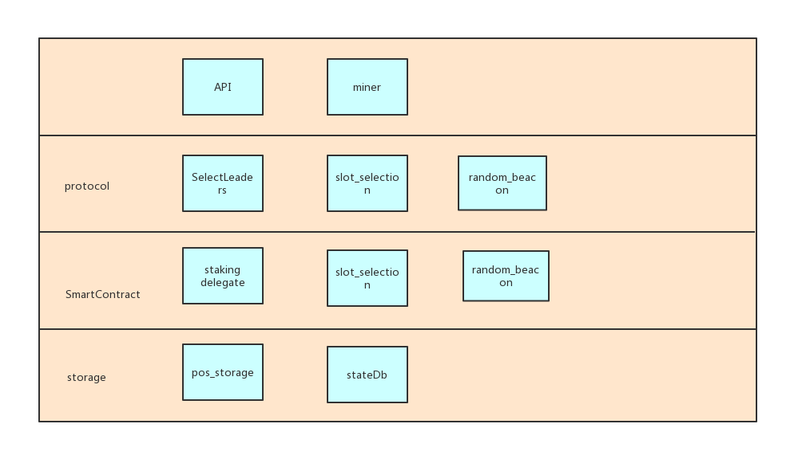
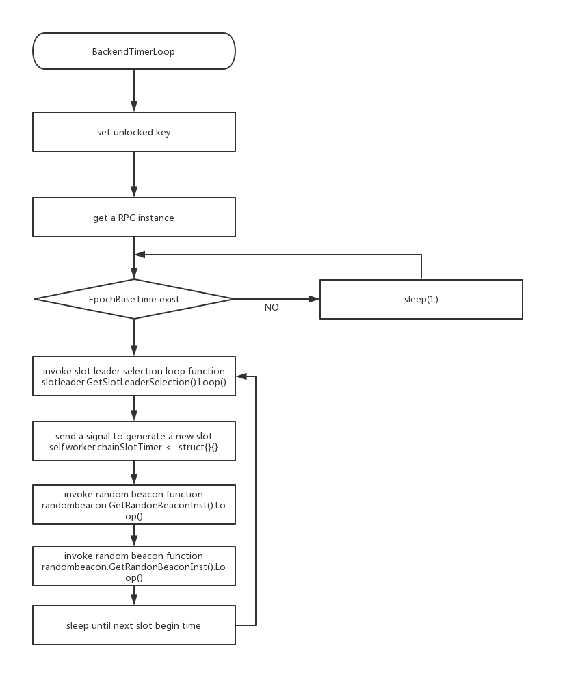

# WanPos Frame

# summary
WanPos has the following modules

# Storage

## pos_storage
pos_storage提供了一些方法用于在本地DB中记录一些信息， 包括epoch的epoch leader 和random beacon group等信息。
当前wanpos创建了3个本地DB
* pos: 保存POS协议运行中的信息,比如slotleader selection过程中产生的随机数
* rblocaldb: 保存每个epoch的random becon group 信息
* eplocaldb: 保存每个epoch的epoch  leader信息

## stateDB
stateDB 保存链上信息

# Smart Contract

## staking delegate contract
Staking delegate contract used for deposit wancoin and the user node will become a stakeholder or a delegate.  
[查看详情](./wanpos_staking_delegate.md)
 

# Wanpos testnet 的启动

## 启动参数 --testnet
指定使用的共识协议
*  datadir和ipc路径
*  genesis的选择
*  engine的选择
* StartMining, 设置miner的key

## PosInit PosInitMiner
Pos的init函数有两个PosInit PosInitMiner
第一个在创建eth结构的时候(backend.go), 挖矿节点和非挖矿节点都会调用. 因为非挖矿节点也需要验证POS交易.  
第二个在开始挖矿的时候(miner.go). 主要是设置挖矿key和生产epocher.

## epoch Leader的选择
由于wanpos协议中需要送所有staker中选择epochLeader, 然后epochLeader发送交易计算产生slot leader, 所以在POC运行的最开始是没有slotLeader的. 因此在wanpos的genesis中内置一些staker. 在运行的第一个epoch(epoch 0), slot leader全部由内置的一个公钥对应的节点担任, 同时从所有内置的公钥中选出50个担任epochLeader, 从所有内置的公钥中选出21个成为random beacon group. 被选中的epochLeader开始发送pos交易, 在epoch的结尾计算产生一组slot Leader用于下一个epoch出块.

|       |Genesis|Epoch 0 | Epoch 1  | Epoch 2...|
|  ---  | ---   | ---    | ---      | ---       |
|staker |builtin|可以注册  | 可以注册  |可以注册     |
|epochLeader|NA |从内置的staker中选|从内置的staker中选|从epoch0的最后一个块中选|
|slotLeader|NA|固定一个|从epoch0中选举出|从epoch1中选举出|

# miner
we add a go routine timer loop in miner module.  

BackendTimerLoop启动一个goroutine定时执行.

the timer will invoke slot_selection and random_beacon 
 

# epoch/RB leader selection

## epoch的最后一个区块
因为区块的blockNumber和时间不对应(运行slot不出块), 为了计算方便, 需要缓存每个epoch的最后一个区块.
在下载区块时, 区块验证通过, 更新epoch对应的最后一个区块号. UpdateEpochBlock
GetTargetBlkNumber()返回某epoch的最后一个区块.

## epoch/RB leader计算的时机
因为epoch/Rb leader无论是否挖矿都需要计算,因为要验证交易, 所以这两个计算放在insertChain里面(blockchain.go)
更新epoch的最后一个区块时(UpdateEpochBlock), 如果epochID更新了, 开始计算下一个区块的epochLeader/RbGroup
GetEpocherInst().SelectLeadersLoop()

