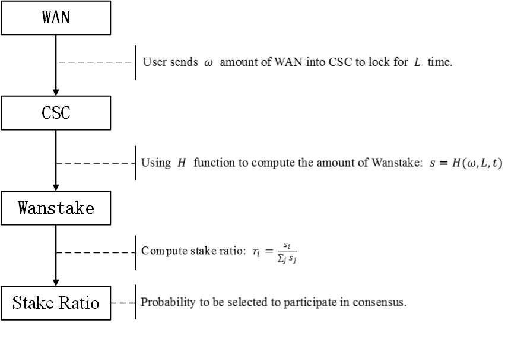

# WanPos staking and Delegate Design

## Summary
Wan holders participate in WanPoS by sending a certain amount of wancoin to consensus smart contract CSC to lock for a period of time determined by themselves. In this way, wans are transformed into wanstake, which increases with wan amount and locking time. Meanwhile the left locking time also influences the stake amount.  





$$ StakeRate = Amount*(10+lockEpoch/(maxLockEpoch/10)) * (2-e^{(t-1)} ) $$

其中t是剩余锁定时间的百分比.


同时，为了减小运行协议节点的规模， 提高WanPos协议的效率，需要引入代理机制  
用户注册wancoin的时候可以指定是否成为代理  
注册成为代理也有最低持币量要求， 数值与注册成为独立pos节点相同  
几个参数:
参与节点或者代理, 最低投入 ??
参加矿池, 最低投入 ??
独立节点锁定epoch的范围是 ?? ~ ??
参加矿池不能指定锁定时间, 与矿池节点一起到期.


1. 激励机制中, 挖矿收入的分发是自动的, 本金的退还也是自动的. lock到期后的2K个slot自动退还.  
2. 为了简化工作量, 同一个publicKey不能追加投资.  参与代理的用户, 可以参加多个代理, 但是同一个代理也不能追加.
3. 注册普通节点时, 允许代替别人支付, 也就是说secPk对应的地址和msg.from不需要是同一个. 退钱的时候退给msg.from帐号. 激励给secPk对应的地址.

## Coin staking and delegate contract
 This contract is implemented by precompiled contract. It will define several functions and structures which will be used in staking and delegate

### 注册合约接口的solidity描述

```
contract stake {
	function stakeIn( bytes memory secPk, bytes memory bn256Pk, uint256 lockEpochs, uint256 feeRate) public payable {}
	function delegateIn(address delegateAddress) public payable {}
}

```
其中
* sPub是stakeholder的public  key.  
* bn256Pk是stakeholder的bn256 public key.   
* lockEpochs是要参加po多少个epoch.  
* feeRate是代理费率. 取值范围1~100.  100表示不参加代理.  
* delegateAddr是要委托的代理的地址.  

### The structures 
 
Staker information which will be stored in db
``` 
type StakerInfo struct {
	Address	    common.Address
	PubSec256   []byte //stakeholder’s wan public key
	PubBn256    []byte //stakeholder’s bn256 public key

	Amount      *big.Int //staking wan value
	LockEpochs   uint64   //lock time which is input by user
	From        common.Address

	StakingEpoch uint64 //the user’s staking time
	FeeRate     uint64
	Clients      []ClientInfo
}

type ClientInfo struct {
	Address common.Address
	Amount   *big.Int
	StakingEpoch uint64
}

```

### Functions of contract

* StakeIn  
process user put wan into CSC  
```
func (p *Pos_staking) StakeIn(payload []byte, contract *Contract, evm *EVM) ([]byte, error) 
```

* DelegateIn  
process user put wan into a delegate.   
```
func (p *Pos_staking) DelegateIn(payload []byte, contract *Contract, evm *EVM) ([]byte, error) 
``` 

## Epoch leader random beacon group selection

### 选择算法.
same to yellow paper.

### wan对应到wanStake算法
1. 函数
// 待定.


### Functions for leader selection
* Create new epocher instance
```
func NewEpocher(blc *core.BlockChain) *Epocher  
```

* Start epoch leaders and random proposers selection
```
func (e *Epocher) SelectLeadersLoop(epochId uint64) error  
```

# 模块接口
## wanStake查询接口
```
type ClientProbability struct {
	addr common.Address
	probability  *big.Int
}
func (e *Epocher)GetEpochProbability(epochId uint64,addr common.Address) (infors []vm.ClientProbability,  feeRate uint64, totalProbability *big.Int, err error) 
```

## 记账接口
```
type ClientIncentive struct {
	addr common.Address
	Incentive  *big.Int
}
func (e *Epocher)SetEpochIncentive(epochId uint64, infors [][]vm.ClientIncentive) (err error)
```

